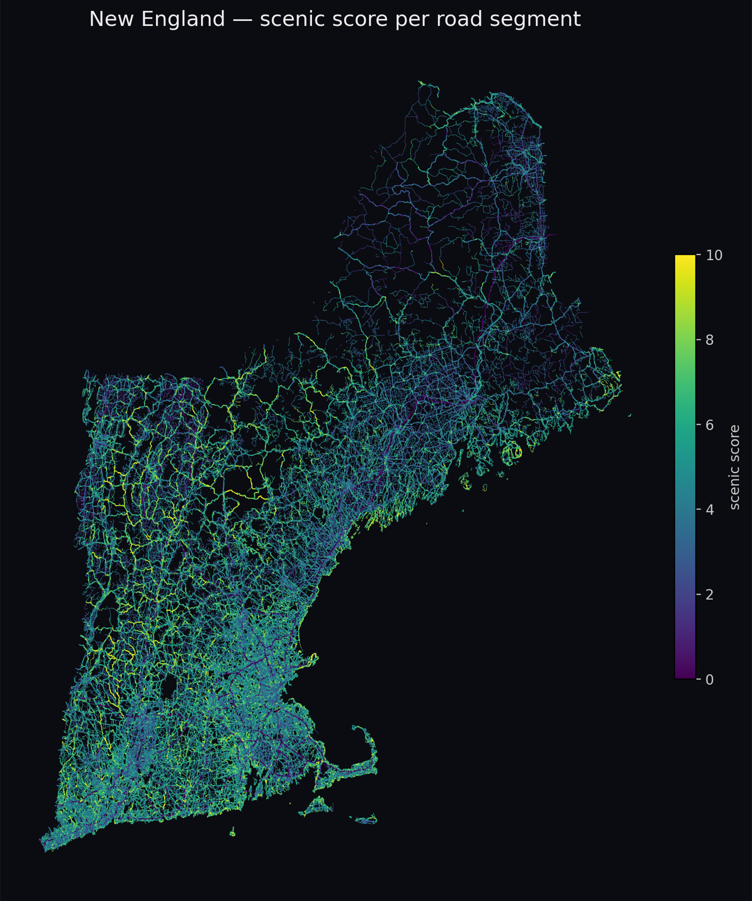

# Victory Lap

Scenic-route navigation: pick a destination, get a route that's beautiful
instead of fast. Every road in the six New England states is scored for beauty
from **open geodata only** ([no Google or Apple data](docs/data-sources.md)),
a Dijkstra router trades
travel time for scenery on a single preference knob, and a native iOS app
(SwiftUI + MapKit) rides on the routing API. 236,000 km of road on a 998k-edge
graph, with live turn-by-turn navigation on a real phone.



<sub>Contains information from [OpenStreetMap](https://www.openstreetmap.org/copyright),
which is made available under the
[Open Database License](https://opendatacommons.org/licenses/odbl/1-0/).</sub>

<!-- docs/ holds committed showcase images (out/ is gitignored build output;
     referencing it here would render a broken image on GitHub). Refresh with:
     sips -Z 1800 out/scenic_heatmap.png --out docs/scenic_heatmap.png
     The credit line above is required: the image is a Produced Work rendered
     from OSM geometry by pipeline/render.py, and ODbL §4.3 wants the notice
     where a reader sees it, not one link away. Keep it with the image. -->

## Both claims are measured

Every drive records itself, so a test drive produces numbers rather than
impressions.

- **The ETA.** 5.7% error pooled over two recorded drives, down from 22%, once
  routes were priced at the speed each road class is really driven plus the
  signals and stop signs facing them —
  [measuring travel times](docs/measuring-travel-times.md).
- **The scenery.** Two buttons on the nav screen record what the driver thinks
  of the road they are on. Over 79 marks the score ranks a road they liked above
  one they didn't **74%** of the time, against a **63%** noise floor computed
  from those same sample sizes —
  [measuring scenery](docs/measuring-scenery.md).

## Architecture

```
OSM PBF ─┐
Terrarium tiles ─┼─> score.py ──> scored_chunks.parquet ─┐
                 │                                         ├─> graph.py ─> graph_*.parquet
                 │                                         │                     │
                 └─> elevation.py ─> relief.tif ──────────┘            router.py (Dijkstra)
                                                                               │
                                                          server/app.py (Flask API) ─> ios/ (SwiftUI app)
```

`pipeline/common.py` holds the constants shared across these stages.

## Build the data

```sh
python3 -m venv .venv
.venv/bin/python -m pip install -r pipeline/requirements.txt

# six free Geofabrik extracts, merged into one; extract.py takes a single PBF
for s in connecticut maine massachusetts new-hampshire rhode-island vermont; do
  curl -L -o "data/raw/$s-latest.osm.pbf" \
    "https://download.geofabrik.de/north-america/us/$s-latest.osm.pbf"
done
osmium merge data/raw/{connecticut,maine,massachusetts,new-hampshire,rhode-island,vermont}-latest.osm.pbf \
  -o data/raw/new-england-latest.osm.pbf

R=data/raw/new-england-latest.osm.pbf; D=data/processed-ne
.venv/bin/python pipeline/extract.py   "$R" "$D"
.venv/bin/python pipeline/elevation.py "$D" 11   # terrain relief raster
.venv/bin/python pipeline/landcover.py "$D"      # WorldCover tree cover
.venv/bin/python pipeline/score.py     "$D"      # scenic score per chunk (cached; --no-cache forces)
.venv/bin/python pipeline/render.py    "$D" out  # heatmap + regional maps
.venv/bin/python pipeline/graph.py     "$R" "$D" # routable graph
```

## Run the API

```sh
.venv/bin/python server/app.py        # dev server on http://127.0.0.1:5057
```

`GET /api/route?from=LAT,LON&to=LAT,LON&pref=0..1[&avoid_unpaved=0..2]` is the
one endpoint that matters; `GET /` describes the service and doubles as a
liveness check. Hosting it behind a tunnel: [`server/DEPLOY.md`](server/DEPLOY.md).
Command-line equivalent:

```sh
.venv/bin/python pipeline/router.py data/processed-ne "42.2626,-71.8023" "42.3551,-71.0657" 0.6
```

The iOS app (`ios/`, open in Xcode) reads its backend URL from the
`VictoryLapAPIBaseURL` Info.plist key in `ios/project.yml`, overridable at
runtime with a `VICTORYLAP_API` environment variable.

## Tests

```sh
.venv/bin/python -m pytest tests/       # backend: 379 tests
cd ios && xcodegen generate && xcodebuild test -project VictoryLap.xcodeproj \
  -scheme VictoryLap -destination 'platform=iOS Simulator,name=iPhone 17 Pro'
```

Geometry and scoring maths run anywhere; the calibration, routing and API tests
need a built graph and skip cleanly without one — point them elsewhere with
`VICTORYLAP_DATA=/path/to/processed`. The iOS suite covers what a simulator can't
exercise and a drive only tests once: where the driver is on the route, when a
maneuver has been passed, which of two overlapping reroutes wins.

## The detail

- [Roadmap](docs/roadmap.md) — what is built, and what the open items wait on
- [How the scenic score works](docs/scoring.md) — the components, the weights,
  and the three failure modes `score.py`'s calibration report exists to catch
- [Measuring travel times](docs/measuring-travel-times.md) — the speed and
  junction model, how to take a drive worth analysing, how to read the report
- [Measuring whether the roads are nice](docs/measuring-scenery.md) — the two
  buttons, the separation statistic, and the noise floor printed beside it
- [Directions accuracy](docs/directions-accuracy.md) — forbidden turns and
  missing instructions, audited over 120 random routes
- [Where the next features plug in](docs/extending.md) — a new scenery
  component, retuning the timing constants, or another region
- [Data sources and licences](docs/data-sources.md) — the three open
  sources, what each one is used for, and how the attribution the app
  carries is derived from each licensor's own wording
- [Licensing: the open questions, answered](docs/licensing-open-questions.md) —
  what the public repository owes, and what it does not

Behind those sit the measurements the constants were fitted against — the
studies, verdicts and audits that say why each number is what it is.
[`docs/README.md`](docs/README.md) indexes all of them.

## Licence

The source in this repository is licensed under the
[Apache License 2.0](LICENSE). See [`NOTICE`](NOTICE) for the attribution that
travels with it.

Two things the Apache licence does **not** cover:

- **`docs/route-census/`** is a Derivative Database under
  [ODbL 1.0](https://opendatacommons.org/licenses/odbl/1-0/) and carries its own
  terms — see [`docs/route-census/README.md`](docs/route-census/README.md).
- **The name.** Apache-2.0 §6 grants no rights to the project's names or marks.
  The app was named **Victory Lap** on 2026-09-20
  ([`docs/victory-lap-naming.md`](docs/victory-lap-naming.md)); the repository,
  the Cloudflare tunnel and `docs/scenic_heatmap.png` still carry the old
  working title, and the word "scenic" remains the right one for the routing
  arm, the score and the roads themselves.
