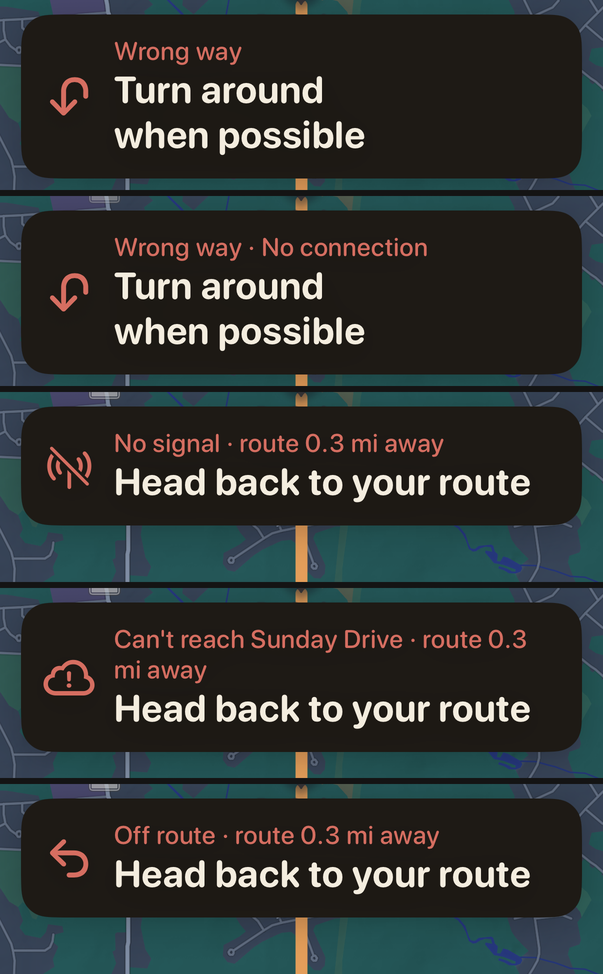

# Mid-drive recovery: lost server, lost signal, wrong way, offline rerouting

**Status: a plan, partly decided and not yet built.** D1–D4 were answered on
2026-10-07 (§8.3); D5 and the new D9 are open. The build is out as a separate
branch, whose record will be `docs/mid-drive-recovery.md` (not on `main` at
`7ce5ef4`). Written 2026-10-05 against `main` at `191e15c`; **revised
2026-10-07 at `7ce5ef4` with the drives of 2026-10-06**
(§1.5, §4.3, §4.6, §7.2, §7.3, §8, §10), which are the first rural ones on
record and the first to meet both failures for real. Where the revision
replaces a figure, the 2026-10-05 one is kept beside it. Nothing in `ios/`,
`server/` or `pipeline/` was changed.
Every number below was measured for this document, with the method and the
command to rerun it. Experiments that needed changed app code ran in scratch
copies made with `git archive HEAD ios tools`, never in the tree.

It answers the outside review's P-04 (a drive that loses its server goes
quietly stale) and P-05 (driving the wrong way along the route never reroutes),
and the general question behind them: what Sunday Drive should do mid-drive
when it cannot reach its server, and whether it should be able to reroute
without one.

## The answer, on one page

**What the 2026-10-06 drives changed (2026-10-07).** Six traces, four of them
real drives, 757 km joined — 2.5 times everything recorded before — on rural
roads in three states. What they add, each measured in the section named:

- **Both failures happened on a real drive, back to back (§1.5).** A route
  sent the car onto a road it could not drive. The driver turned back and
  drove 1.9 km backwards along the route, then 3.2 km on a detour up to
  829 m from it. That was 469 s, and today's build, replayed on those fixes,
  shows the abandoned road's "Continue onto …" the whole way, its distance
  growing as the car drove off, and says nothing. Replayed with each recorded
  reply only at the moment it was asked for, today's build asks **5 times**
  in that stretch; the trace holds no reply to any of them, while all six of
  the drive's other requests were answered. So P-04 is not a persona any
  more.
- **The wrong-way detector works on real reversals, and neither driver
  needed the instruction it speaks (§4.6).** Replayed on all 18 recorded drives, it fired
  twice, both on real reversals and both deliberate: once a U-turn, 7 s
  before today's reroute would have come, and once 9 s into the reversal
  above, after which it held "Turn around when possible" for 196 s while the
  driver drove away on purpose. It gives way to the off-route state after
  30 s or 300 m (§8.1, item 3b), and the wording is a new decision, D9.
- **A wrong-way reroute must not send the driver back where they turned
  from.** That is what the U-turn fix now on `main` (`7ce5ef4`,
  `docs/reroute-uturn.md`) prevents, and the detector's reroute has to go
  through it (§4.6).
- **Real drives leave the line a quarter as often on rural roads**, 3.2 times
  per 100 km against 11.7, but the one that got no answer went 829 m from it
  (§7.2). With answers, the furthest was 301 m. GPS stayed good: 3 holes over
  10 s in 757 km, the longest 15 s, which supports leaving item 5 out.
- **Successful reroutes are quick even there**: 29 replies, a median 0.9 s
  from request to adoption, the slowest 5.6 s (§7.2). A failure leaves no
  record, so how long the failed ones took is unknown. The build adds a trace
  record per attempt.

The owner's answers to D1–D4, given on 2026-10-07 after the first version,
are in §8.3.

**Before submission (launch is planned for 2026-10-22, `docs/marketing-plan.md`):
about six to seven working days, all of it on the phone, none on the server.**

1. **Say what is true when a reroute fails (P-04).** A day and a half. Today a failed
   request is a `try?` (`NavigationModel.swift:1380-1384`) and the banner keeps
   the abandoned line's next maneuver. Measured on 184 simulated outages: the
   "Finding a way back…" banner was on screen for **0 of 32,919** outage fixes,
   because failures return in milliseconds and that banner shows only while a
   request is in flight. Replace it with an honest off-route state — "No
   signal · route 0.3 mi away / Head back to your route" — and one spoken line.
2. **Stop network failures feeding the reroute backoff (P-04).** A dropped
   connection currently climbs the same 8 s → 120 s backoff that exists for a
   server that keeps answering with the route the driver is ignoring
   (`:1389-1396`). Measured: once the server came back, the reroute landed a
   **median 64 s later (max 85 s)**. Count failures separately, retry when the
   phone's network path comes back (`NWPathMonitor`), and otherwise retry at
   most once a minute. In the prototype, recovery from a dead zone came on
   the first fix after the signal returned, on all 70 drives. A server that is
   down while the phone has signal still waits up to a minute, half today's
   worst case (measured after a 180 s outage: a median 58 s, against 64 s
   today); T3a below is the real fix for that.
3. **Detect the wrong way by heading, not by `travelled` (P-05).** Measured: a
   car driving its own route backwards for 2 km **never asked for a reroute on
   184 of 192 routes (96%)** and on 18 of 20 loops, and nothing was spoken on
   any of the 192 routes. A detector that reads the car's course against the
   line's direction, armed only after the car has gone the right way on that
   line, caught **all 78 reversals** (58 routes, 20 loops) within 4–5 s and
   60 m, and asked for the reroute on the same fix. It raised **no false alarm**
   on 288 perfect, noisy, spike, canyon and wrong-way-start drives or on 85
   loop drives, and the twelve real drives replay identically, all 306
   utterances. On missed turns it fired once in 56, and rightly: that car had
   carried straight on down a road its route had just come up (§4.3). About
   two days. *(2026-10-07: it also caught both real reversals on record, in
   6 and 9 s, and both were deliberate. So the wrong-way state must give way
   after 30 s, and its reroute must not turn the driver back where they came
   from: §4.6.)*
4. **Cap a loop's match at its far point until the car has been there.** This
   is the cheapest fix for the case P-05 hides on loops, and it also covers
   the drive simulation's Finding 1 for the whole outbound half of every loop.
   Measured today: reversing on a road a loop drives twice made the match jump
   to the return pass on 3 of 20 loops, silently latching "past the far point"
   and cutting two loops short (30 → 19 km, 57 → 34 km). Stowe's banner read
   "Arrive at your destination · 7.5 mi". With the cap no loop lost its far
   point. Under real-trace GPS noise the 26 loops, including six of
   150–400 km, drove 99.9% of their planned length against 92% today. Under
   the drive simulation's spikes each drove at least 87% of its own length,
   where today they drive 13% of the distance and 23 of 26 stop short of half
   way; under its canyon multipath, 98% against 43%. Half a day.
5. **Say when GPS is lost.** *(Left out of the release by the owner,
   2026-10-07; the October drives had three holes over 10 s in 757 km.)*
   With recording off in every build
   (`DriveTrace.swift:75`), nothing redraws the screen when fixes stop: the
   only timer that would is started only when a trace exists
   (`NavigationModel.swift:614`). Half a day.

**After launch, in this order. §7 says the problem is common enough to
justify it.** By the carriers' own maps, about one scenic drive in four, and
one loop in two, crosses at least a kilometre with no 4G LTE from any carrier
— mostly in Maine, Vermont and New Hampshire:

6. **T3a — Apple's directions when our server is down but the network is up.**
   `MKDirections` to a rejoin point on our own line, then our line onwards. It
   covers an outage of the one Oracle box (and the domain lapsing on
   2026-10-28 if it is not renewed), not a dead zone. Two to three days.
7. **T1 — the road network within 1 km of the route, shipped with it.**
   Measured on the real graph: 45 KB gzipped on the median route and 214 KB
   on a 400 km loop, against 9 KB and 79 KB for the route itself. From 90% of
   missed turns caught within 150 m, a search inside it finds exactly the
   server's way back, in under a millisecond on an M2. Two to three weeks,
   most of it porting the maneuver text (`pipeline/router.py`), and it ships
   ODbL data to phones, which brings share-alike obligations (§9). Shipping
   the server's own answer instead (T1b) measured worse value.
8. **Not T2.** The whole region is 37 MB gzipped, and searching it is not the
   problem: 83 ms for the whole graph on an M2. But it needs a Swift port of
   the router and the maneuver code, another 37 MB with every graph rebuild,
   and it distributes the whole database. It is a different product.

**Decisions this needs from the owner** are listed in §8.3. The two that change
what gets built are D1 (take items 1–5 into the release) and D2 (what a loop
should do when the driver turns back early on a road it drives twice).

---

## 1. What happens today, measured

### 1.1 What the device holds

During a drive the phone has the line it is following (coordinates), that
line's steps, and nothing else of the road network (`NavigationModel.swift:36-44`).
On-route guidance and the voice therefore run without a server. Everything
else is a request: every reroute, a loop's resume through its far point
(`fetchLoopResume`, `:271-274`), and "Switch to fastest" (`:1288`). The
response that started the drive carried both arms, but only the chosen one is
handed to the drive (`RouteModel.swift:319-331`).

### 1.2 P-04: a failed reroute, reproduced

**Instrument.** The repo's end-to-end harness (`ios/Tests/SimulatedDrive.swift`)
drives the real `NavigationModel` and reads the real `NavView.bannerText`, on a
synthetic clock, against a local server. A new persona, `serverDown`, misses a
turn the way `missedTurn` does but carries on along a real road for 1.5–3 km,
and every request made in the 180 s after the deviation fails. The server
"returns" after that. Run over the non-island routes of
`tools/e2e_od_pairs.json` at pref 0.5 — 194 of the 195, because the server
refuses `suburban-005`, whose destination is too far from any road
(`SNAP_MAX_M`) — of which 184 could be staged with a detour that long, and
the 20 committed loops (`loopServerDown`, 15 staged).

| what | routes (184) | loops (15) |
|---|---|---|
| requests during the 180 s outage | 4 on 181 drives, 3 on 3, at about 8, 25, 58 and 123 s | 4 on 14 |
| fixes on which "Finding a way back…" showed | **0 of 32,919** | 0 of 2,700 |
| banner during the outage | the abandoned line's next maneuver on all 2,197 sampled fixes | the same, all 180 |
| delay from the server returning to the reroute landing | **median 64 s, p90 75 s, max 85 s** (177 drives; 7 rejoined on their own) | median 64 s |
| loops driven more than 3 km short | — | **6 of 15** |

The 64 s is arithmetic, not chance. Four failures put `consecutiveReroutes` at
4 and the cooldown at its 120 s cap (`:381-382`, `:394-397`); the fourth attempt
fell at about 123 s, so the next was due at about 243 s, 63 s after the server
came back. At 20 m/s that is another 1.3 km driven on a stale instruction.

Two things about the error itself that the brief did not have:

- **The production outage and the local one fail differently.** A stopped local
  server refuses the connection, which is a `URLError` and becomes
  `ServiceError.offline` (`RouteService.swift:266-270`). The production server
  sits behind a Cloudflare tunnel, which answers for an absent origin with HTTP
  530, so the phone sees `ServiceError.unreachable(530)` (`:62`, `:279`). Today
  both are swallowed by the same `try?`, so it does not matter yet; any fix that
  tells the two apart must be tested with both.
- **A timeout is the slow case.** On a weak signal the request runs to its 15 s
  limit (`RouteService.swift:94-95`). Only then is "Finding a way back…" on
  screen, for 15 s at a time, followed by the stale banner. The harness cannot
  show this, because it awaits a reroute in zero simulated seconds
  (`ios/Tests/SimulatedDrive.swift:24-25`); it is inferred from the code.

### 1.3 P-05: the wrong way along the route, reproduced

**Instrument.** A new persona, `wrongWayAlong`: the car drives the route
normally to 40% of its length (at least 2 km in), makes a U-turn on the route
itself, drives back along the line for up to 2 km, then turns round again and
finishes. The loop version, `loopWrongWay`, reverses at 30% of the loop or 1 km
before its far point, whichever is first. The same 194 routes at pref 0.5
(192 long enough to reverse on) and all 20 committed loops.

| | routes (192 reversed) | loops (20) |
|---|---|---|
| no reroute request while driving back | **184 (96%)** | **18 (90%)** |
| the few that did: first request after | median 84 s, 1,008 m (46–153 s) | 50–114 s |
| utterances while driving back | **0** | 3, on 2 drives, all for maneuvers behind the car |
| footer while driving back | "Off your route" 84%, a road name 16% | 76% / 24% |
| banner | a maneuver behind the car, its distance growing | the same; Stowe read "Arrive at your destination · 7.5 mi" |
| loop lost "before the far point" while reversing | — | 3 (`loop-001`, `004`, `015`) |
| loop driven more than 3 km short | — | `loop-001` 19.1 of 30.1 km, `loop-004` 34.0 of 56.7 km |

The mechanism is the one the brief describes, and the harness confirms each
step. The car runs back past the match floor; `reseatIfPinned`
(`NavigationModel.swift:1090-1104`) re-seats the match onto the line behind it
every time it gets more than about 160 m behind `travelled`; so `offRoute` never
stays above 60 m (`:125`) long enough to make a streak, and `runningBackwards`
(`:1186-1189`) freezes the banner and silences the voice through
`stepsDescribeWhereWeAre` (`:848-853`).

**On loops it is worse, and it is the brief's Trap 2.** Where a loop drives a
road twice, driving the first pass backwards *is* driving the second pass
forwards. On three loops the match jumped to the later pass, `trackTurnaround`
latched `passedTurnaround` because `here.travelled >= loop.along` (`:333-336`),
and every later reroute asked for the short way home — `loopWaypoint` is the
only thing that keeps a loop a loop (`:314-317`), and it had been switched off by
a jump, not by the far point going by.

### 1.4 Two states nothing on screen can show today

- **GPS lost mid-drive.** `LocationManager` discards any fix worse than 65 m or
  older than 15 s before the drive ever sees it (`LocationManager.swift:99-102`,
  `:191-195`, `:444`), so "degraded GPS" past 65 m and "no GPS" are the same
  thing to `NavigationModel`. The only check for silence is the trace
  recorder's (`recordingProblem`, `NavigationModel.swift:763-777`), it is hidden
  when recording is off (`NavView.swift:492-494`), and recording is off in
  every build (`DriveTrace.swift:75`). Worse, the two-second tick that lets a
  silent stream redraw the screen at all is started only when a trace exists
  (`NavigationModel.swift:614`, `:716-724`). So when fixes stop, the banner, the
  distance and the arrival time all freeze where they were.
- **A server that answers "no".** A 4xx with a message — "no route found",
  "closed for the season" — is `ServiceError.server` (`RouteService.swift:57`)
  and is swallowed with the rest. It is a different failure from a network
  one: the server is up and has nothing better to offer.

### 1.5 Both, on a real drive (2026-10-06)

Everything above was reproduced on personas. On 2026-10-06 it happened on a
real drive (`drive-2026-10-06-192759`; aggregates and durations only, since
the traces are private). About 2.6 hours in, the route led onto a road that
could not be driven, which is its own fix (state road-class data, a separate
branch). What matters here is what the app did next, which is what it will
do the next time any route goes wrong.

**What the car did**, from the trace (`tools/trace_reroute_timing.py`):

| | |
|---|---|
| stopped at the road, turned round | about 80 m off the line for a few seconds |
| drove back along its own route | **1,932 m, 205 consecutive fixes, 196 s**, on a line it had followed for 155 minutes |
| left it on a detour | **192 s, 3,159 m driven, up to 829 m from the line** |
| rejoined the same route | 3.1 km along it from where it left, 1.2 km beyond where it had turned back |
| from first leaving the line at the road to the rejoin | **469 s, about 5 km** |
| GPS throughout | stated accuracy 5 m, no hole in the fixes |
| replies landing in that time | **none**; all six of the drive's other requests were answered, in under a second |

**What today's build showed and said.** The same fixes, replayed through
`NavigationModel`, `VoiceGuide` and `NavView.bannerText` at the code the
phone ran (`83fe53a`): the banner held the abandoned road's "Continue onto
…" for the whole 469 s, its distance rising from 0.3 to 1.5 mi as the car
drove away from it and falling again on the detour. It was never red, and
nothing was spoken until the car was back on the route.

**What it asked.** `DriveReplay.run` cannot answer this: it hands out the
recorded replies in order, so the first request that really failed is handed
the next reply in the file, from 33 minutes later. A timed replay
(`tools/timed_replay_tests.swift`, §11) answers a request only with the
recorded reply to that request — the reply whose `req_lat`/`req_lon` is a
fix within 3 s of it — and fails every other request with
`URLError(.notConnectedToInternet)`. Checked first against what is known:
across the five October drives that asked anything, it asked for **28 of
the 29 recorded replies** within 3 s of the real request, and the 29th
about 3 s early. On this drive it asked for all six. In those 469 s it asked
**five more times**: once at the stop, then four times on the detour, 2,
19, 51 and 116 s after the car passed 60 m. That is today's backoff after
consecutive failures (§3.1). The trace holds no reply to any of them.

So the five requests were made and failed, or were answered with an error,
and the driver was told nothing: P-04 exactly. Which it was is not settled
by the trace. A dead zone is likely on that kind of road (§7.1 has the
state's share), but an outage of the server would look the same. The box's
request log for those minutes would settle it, and the build adds a trace
record for every attempt, so the next one is a measurement.

The 196 s backwards is P-05 exactly, too: `travelled` fell by 1.9 km while
the match stayed on the line, so `offRoute` never built a streak and
nothing rerouted until the car left the road. §4.6 is what the prototype did
with it.

---

## 2. The failure states (question 1)

Every state below is a proposal. The copy is in the table, with the symbol.
The banner keeps its one rule — "words only, a driving banner is no place for
a tap target" (`NavView.swift:248`) — and red (`alert: true`) keeps meaning
"something is keeping the drive from being followed" (`NavView.swift:228-230`).
The order is the order the checks run, first match wins, slotted in after the
two existing location-permission states and before the ordinary instruction
(`NavView.swift:235-276`).

"Route 0.3 mi away" is the straight-line distance from the car to the nearest
point of its line no more than 300 m behind where it was last matched, so it
never points at an earlier pass of a loop. It is printed like the existing
pre-join copy, "0.4 mi away · Head to the start of your route"
(`NavView.swift:265-268`), and it says *away*, never *ahead* or a direction:
it is a straight line, and §5.2 measures how far that can be from the way
back by road.

| # | State, and how it is detected | Banner: symbol · over · main | Voice | Map | What ends it |
|---|---|---|---|---|---|
| 1 | **Wrong way along the route, connected.** The detector in §4 fires; a reroute is asked for at once, with the heading. | `arrow.uturn.down` · **Wrong way** · **Turn around when possible**, until the replacement lands; then its first instruction | "Turn around when possible." Once, on detection. Then the replacement's opening maneuver, which agreed with it on 76 of 78 measured reversals and today is often never spoken (overnight Finding 3). Once that is fixed, say the line only if the reply has not landed within 2 s (§4.3) | Unchanged: the line and the car | The replacement is adopted; or the car turns round, or leaves the line (row 3–6) |
| 2 | **Wrong way, and the reroute failed.** As row 1, and the request failed. | `arrow.uturn.down` · **Wrong way · No signal** (or **· Can't reach Sunday Drive**) · **Turn around when possible** | Row 1's line only. Nothing more on the failure | Unchanged | As row 1, or the retry lands (§3) |
| 3 | **Off route, the reroute failed, no network.** A request failed and the path monitor reports no path. | `antenna.radiowaves.left.and.right.slash` · **No signal · route 0.3 mi away** · **Head back to your route** | "No connection. Head back to your route." Once per episode | Unchanged. Optionally the camera widens to show the car and the nearest point of the route (decision D5) | Back within 30 m of the line (`joinConfirmMeters`, `NavigationModel.swift:513`); or the path returns and the retry lands, whose opening instruction is then spoken |
| 4 | **Off route, the reroute failed, the server is unreachable.** A 5xx, Cloudflare's 530, a timeout or an undecodable reply, with a network path. | `exclamationmark.icloud` · **No connection · route 0.3 mi away** · **Head back to your route** ("Can't reach Sunday Drive · …" wraps, see below) | As row 3 | As row 3 | As row 3, on the slower cadence of §3 |
| 5 | **Off route, the server said no.** A 4xx carrying the server's own message ("no route found", "closed for the season"). | As row 6, and the server's message under the trip card for 6 s (the existing `report`, `NavigationModel.swift:744-752`) | Nothing new | Unchanged | Back on the line, or a later reroute lands |
| 6 | **Off route, connected, no reroute yet.** Inside the cooldown or backoff (`:394-397`), or the server handed back the same line (`merge`, `:1418-1420`). More than 300 m from the end only: inside that the driver is parking (`noRerouteWithinMeters`, `:418-434`), and today's last instruction stays. | `arrow.uturn.backward` · **Off route · route 0.3 mi away** · **Head back to your route** (today: the abandoned line's next maneuver) | Silent, as today | Unchanged | Back on the line, or the next reroute |
| 7 | **Rerouting.** A request in flight. Unchanged. | `arrow.triangle.2.circlepath` · **Off route** · **Finding a way back…** (`NavView.swift:253-256`) | Silent | Unchanged | The reply, or the failure (rows 2–5) |
| 8 | **No GPS.** No usable fix for 10 s, not paused and not arrived. Needs the 2 s tick to run on every drive, not only recorded ones (`NavigationModel.swift:614`). | `location.slash` · **No GPS signal** · the last instruction, unchanged: the car was on its route when the fixes stopped, so it is still the best guess. Before joining, today's "Waiting for GPS" | Silent: nothing can be timed without a position | MapKit's own blue dot may keep moving on coarse positions our 65 m filter rejects; it is MapKit's, not ours. Accepted and noted | The next usable fix |
| 9 | **Degraded GPS**, stated accuracy 30–65 m. | No new state | Unchanged | Unchanged | — |
| 10 | **"Switch to fastest" with no connection.** Today a failed switch restores its state and says nothing (`:1325-1339`), so in a dead zone the tap does nothing at all. | No banner state. Under the trip card for 6 s: **Can't switch — no connection.** | Nothing | Unchanged | — |

The prototype's banners, rendered from the real `NavView` on an iPhone 17 Pro
simulator: wrong way, wrong way with no connection, no signal, server
unreachable, and off route while connected. These are the prototype's words,
which row 2 refines.

Only the fourth fails as drawn: "Can't reach Sunday Drive · route 0.3 mi
away" wraps in the middle of the distance. That is why row 4 says "No
connection" instead. Check it, and every row, at the largest Dynamic Type size
when it is built; this render is at the default size.

Row 9 is behaviour rather than words. A fix whose own error bar covers the
gap is not evidence of leaving the road, so it counts toward a reroute only
when `offRoute > 60 m + horizontalAccuracy`, and the one-fix rule past 200 m
needs two fixes. Those are the drive simulation's Findings 3 and 2, which cut
canyon reroutes 310 → 0 and spike reroutes 1,468 → 20 in that report. The
wrong-way detector ignores any fix worse than 30 m (§4).

**On a loop**, all of the above apply. Before the far point a reroute goes via
the far point, as today. Turning back on a road the loop drives twice is row 1,
not "the driver has skipped ahead" — decision D2.

---

## 3. Retry policy (question 2)

### 3.1 Two failures, two counters

The backoff exists for a server that answers correctly and is ignored: on the
2026-08-22 drives the same right answer was asked for ten times in 160 s
(`NavigationModel.swift:362-380`, `docs/reroute-audit.md` Findings 4–5). That
is still true and the backoff stays. A request that never lands was folded into
the same counter as "the plainest case of asking not helping" (`:1389-1395`),
and that is the part to undo: asking again *does* help once the network is
back, and the backoff is what makes it wait.

| | an unhelpful success | a failed request |
|---|---|---|
| what it is | the server answered, with a route the driver is not taking, or with its own "no" (`.server`) | nothing answered usefully: no path, a timeout, a 5xx, Cloudflare's 530, or an undecodable body |
| counter today | `consecutiveReroutes`, 8 s doubling to 120 s (`:381-382`, `:394-397`) | the same counter (`:1396`) |
| proposed | **unchanged** | its own counter, `consecutiveFailures`, which never touches the backoff |
| when to try again | after the cooldown, as today | **when the network path comes back**, at once and once; otherwise, while a path exists, at 15 s, 30 s, then every 60 s; **never on a timer while there is no path** |
| reset by | 30 s on the line (`:388`) | any request that lands |

`NWPathMonitor` is used for two jobs only: to say which failure this is (rows
3 and 4 of §2), and to trigger the retry when a path comes back. It never
gates a request the driver asked for. A request is always allowed to try,
because a path can be "satisfied" while nothing gets through — a weak signal,
a captive portal, our server down — and only the request finds that out. That
is why the timer survives for the satisfied case.

`waitsForConnectivity = false` stays as it is (`RouteService.swift:96-98`).
Its reason still holds: a request parked until the network returns would plan
from where the car used to be. With it off, Apple documents that a request
with no connectivity "fails immediately with an error, such as
`NSURLErrorNotConnectedToInternet`"
([`waitsForConnectivity`](https://developer.apple.com/documentation/foundation/urlsessionconfiguration/waitsforconnectivity)).
So the path monitor's callback is what replaces the waiting: it makes a fresh
request from the newest fix.

The same split fixes the one user-initiated path. A failed "Switch to fastest"
today restores its state silently (`:1325-1339`); it should say so (row 10 of
§2) and leave the counters as it found them, which it already does.

### 3.2 What each choice costs in battery

The radio, not the request, is the cost. Huang et al. measured an LTE phone's
radio staying in its high-power state for 11.6 s after any transfer (tail power
1,060 mW), after a 260 ms promotion at 1,211 mW (*A Close Examination of
Performance and Power Characteristics of 4G LTE Networks*, MobiSys 2012,
Table 3). Each attempt therefore costs about 0.31 J + 12.3 J ≈ **12.6 J**,
whatever it carries. These are 2012 figures and modern modems release sooner,
so read the numbers below as upper bounds.

| retry policy, while off route and failing | radio energy per hour | of a ~15 Wh (54 kJ) phone battery |
|---|---|---|
| every 8 s (no backoff) | the tail never ends: ≈ 1.06 W, **≈ 3.8 kJ** | ≈ 7% an hour |
| today: gaps of 16, 32, 64 s, then every 120 s | ≈ 33 attempts, **≈ 0.4 kJ** | ≈ 0.8% |
| proposed, path present: 15, 30, then every 60 s | ≈ 60 attempts, **≈ 0.76 kJ** | ≈ 1.4% |
| proposed, no path | **≈ 0**: no attempt is made on a timer, and one made anyway fails at once with `NSURLErrorNotConnectedToInternet`, before any transfer | ≈ 0 |

So the proposal spends at most about 0.6% of a battery an hour more than today
in the one case where it costs anything: a path that exists but fails, which is
a weak signal or our server being down. That is the case where retrying sooner
is worth something. In the commonest dead zone, no service at all, it costs
nothing, and it recovers on the second the signal returns rather than up to
two minutes later.

### 3.3 What it does to recovery, measured

| persona, 180 s outage from a missed turn | today (`191e15c`) | prototype |
|---|---|---|
| `serverDown`: path present, every request fails with 530 | median 64 s after the server returns (max 85 s); up to 120 s for any outage once the cap is reached | median 58 s for this 180 s outage, max 60 s¹ (53 of 55 routes, 15 of 15 loops; the other two were back on their line before the next try was due); **at most 60 s, about 30 s on average,** for an outage of any length |
| `deadZone`: no path, then the path returns | the same as `serverDown`: today's code cannot tell them apart | **the next fix after the path returns, on all 55 routes and 15 loops**, with one request during the outage instead of four |
| requests made during the outage | 3–4 | 1 (`deadZone`: none on a timer while there is no path); 4–5 (`serverDown`), at about 8, 24, 55, 116 and 177 s |
| loops ending more than 3 km short after an outage | 6 of 15 | 1 of 15 (the far-point cap, §4.4) |
| "Finding a way back…" during the outage | 0 of 32,919 fixes | the off-route state of §2 on every sampled fix once the first request has failed, and one spoken "No connection. Head back to your route." per drive |

¹ The 180 s outage is unlucky for this cadence: the fifth try falls at about
177 s, so the sixth is due a minute later. A first run of the prototype
harness also called the path-restored hook at the end of a `serverDown`
outage, which a phone whose path never changed could not do. Its "0 s" was
discarded, and these figures are from a rerun without it (the committed patch
calls the hook only for `deadZone`). For a server that stays down, T3a (§6.4)
is the fix, not a faster timer.

---

## 4. Wrong way along the route (question 3)

### 4.1 Why `travelled` cannot be the signal

`travelled` falling is what a wrong-way car does, but it is also what three
correct cars do:

1. **A loop on a road it drives twice.** Driving the first pass backwards is
   driving the second pass forwards, along the same coordinates. Whether
   `travelled` falls depends on which pass the match holds, which is the coin
   flip `docs/loop-matching-fix.md` measured to the nanometre. Measured above:
   3 of 20 loops jumped to the later pass instead, and `travelled` *rose* by
   kilometres.
2. **A reroute that opens with a U-turn.** The replacement starts at a junction
   ahead and comes back past the car, so the car drives against it until it
   turns (overnight Finding 3: 12 of 53 real reroutes did this). In the twelve
   real drives there are nine runs of five or more moving fixes whose course
   pointed against the line they were on, the longest 20 fixes. **Eight began
   one second after a replacement was adopted**, and the ninth 17 s after one,
   at a median 4.7 m/s. None began on a line the car had been following.
   Measured with `tools/trace_excursions.py`: 135 of 18,375 moving on-line
   fixes (0.7%) pointed 120° or more against the line. The October drives
   (2026-10-07, `tools/trace_reroute_timing.py`) say the same: 305 of 33,945
   (0.9%), and of their nine runs of five or more, **eight began within 20 s
   of a replacement being adopted**, the longest 19 fixes. The ninth is the
   real reversal of §1.5, 205 fixes long, on a line the car had followed for
   155 minutes. That is the whole separation the detector relies on, now seen
   on real roads in both directions.
3. **`reseatIfPinned` itself.** It moves `travelled` back by design, up to
   500 m at a time (`NavigationModel.swift:240`, `:1098-1100`), whenever the floor
   was wrong. A detector built on `travelled` would fire on every re-seat.

What tells these apart is the **heading**. On a road driven twice the two
passes run in opposite directions, and the car's course agrees with one of
them. A car doing the wrong thing has a course that agrees with *no* pass of
its line where it stands.

### 4.2 The detector

Run on every fix, after the existing match:

1. **Armed only after the car has gone the right way on this line.** At least
   100 m of forward progress along it, counted only on fixes whose course
   agrees with the line within 60° where the car is matched. Measuring the
   furthest match since adoption instead, which was the first version,
   is not enough. On one real drive, replayed, a storm-era replacement doubled
   back past the car, which crept 40 m "forward" along it while pointing the
   other way and then fired. Counting only aligned progress is what keeps case
   2 silent: on a replacement that opens with a U-turn the car has not yet
   gone the right way, and the line's own first instruction already says to
   turn. The direction at the match is a binary search over the line's
   cumulative lengths, so arming costs nothing per fix.
2. **Only fixes that can say which way the car points count.** Speed at least
   3 m/s, a course reported, stated accuracy 30 m or better. Any other fix
   neither builds the case nor clears it — a car slowing to turn round keeps
   its evidence.
3. **The car is on its line.** The unconstrained match is within 30 m
   (`joinConfirmMeters`). Off the line is the ordinary off-route path's
   business, not this one's.
4. **Every pass of the line near the car is read for its direction.** All runs
   of segments within the match's offset plus 5 m, split where the line itself
   turns back. If **any** pass runs within 60° of the car's course, the car is
   going forwards somewhere legitimate and the case is cleared. If the only
   passes run 120° or more against it, that fix is one vote.
5. **Five votes in a row, and 40 m of the line gone backwards** between them.
   One spike cannot do it: a fix 220 m off is off the line, so it clears rule 3
   rather than voting. A canyon cannot do it: its fixes are worse than 30 m.
6. **On a loop before its far point, passes beyond the far point do not
   count** — and neither may the match land there (§4.4). That is what turns
   case 1 into a wrong way rather than a skip.

When it fires: **online**, ask for a reroute at once with the heading. The
server snaps to the end of the road that lies ahead of the car
(`Router.snap`, `pipeline/router.py:1350-1398`) and returns a route that turns
it round, under the same cooldown and backoff as any off-route reroute.
**Offline**, the banner and voice of §2 row 2: "Turn around when possible",
said once.

### 4.3 What it did, measured

The prototype ran in a scratch copy, against today's build on the same
routes and personas: the 60-route sample (ten per category, seed 20261005),
the 20 committed loops, and six loops of 150–400 km from the same origins.
The noise personas were re-created from the drive simulation's descriptions
(§11). Every number below is the committed prototype
(`tools/mid_drive_prototype.patch`), whose detector arms on course-aligned
progress (§4.2, rule 1). The first version armed on the furthest match
instead; it is shown only where the two differ.

**Driving the wrong way along the line**, on the 60-route sample (58 long
enough to reverse on) and the 20 loops. The baseline column is the same drives
from §1.3:

| | today (`191e15c`) | prototype |
|---|---|---|
| routes: a reroute requested while driving back | 2 of 58, after 74–103 s | **58 of 58**, on the detecting fix |
| routes: detected after | — | **4–5 s, 48–60 m**, on every one |
| loops: a reroute requested while driving back | 2 of 20 | **20 of 20**, after 4–5 s |
| loops: lost "before the far point" | 3 (`001`, `004`, `015`) | **0** |
| loops: driven more than 3 km short | 2 (`001` 19 of 30 km, `004` 34 of 57 km) | **0** that skipped the far point¹ |
| Stowe (`loop-015`), reversed on the Notch out-and-back | "Arrive at your destination · 7.5 mi" | detected at 5 s, far point kept, 41.9 of 40.8 km driven |
| spoken while driving back | nothing on routes; 3 wrong instructions on loops | "Turn around when possible." exactly once, on every drive |

¹ One loop, `loop-019`, came back 8 km shorter than planned. It kept its far
point; the replacement through it simply took a shorter way home, which is
what any loop resume does today.

Two things this does not fix, both already open elsewhere. The replacement
route's own first instruction ("Make a U-turn…", or "Head southwest on…") was
driven through unspoken on 48 of 56 routes and 14 of 20 loops. The banner also
sat behind the car on 22 routes and 10 loops (at most 263 m) after the turn.
That is overnight Finding 3, and it needs its own fix. Until then the driver
has heard "Turn around when possible" and the banner shows the turn, which
agree. And the persona does not obey the new route — it drives its
scripted 2 km back before turning — so "how far a driver goes the wrong way"
is the driver's, not a number this measures.

**False alarms**, on drives that never reverse. Every column but the alarms is
today's build against the prototype on the same drives:

| persona | drives | wrong-way alarms | reroutes | banner behind the car | missed prompts |
|---|---|---|---|---|---|
| `perfect` | 59 | **0** | 0 → 0 | 1 → 1 | 0 → 0 |
| `noisy` | 59 | **0** | 0 → 0 | 0 → 0 | 2 → 2 |
| `spike` (one fix in 150 thrown 220–450 m) | 59 | **0** | 837 → 837 | 232 → 232 | 63 → 63 |
| `canyon` (40 s in every 4 min at σ 35 m, accuracy 30–60 m) | 59 | **0** | 247 → 247 | 210 → 210 | 15 → 15 |
| `wrongWayStart` | 52 | **0** | 52 → 52 | 90 → 90 | 2 → 2 |
| `missedTurn` | 56 | **1**, and not a false one (below) | 60 → 60 | 114 → 115 | 3 → 4 |

Nor on loops: no alarm on any of 85 loop drives, 26 under spikes, 21 under
canyon multipath, 21 under real-trace noise and 17 with a missed turn before
the far point. Their other columns change, because of the cap (§4.4).

**The twelve August drives, replayed** (`ReplayDumpTests`; recorded fixes, the
recorded replacement routes in order):

| | identical to today's build | wrong-way alarms |
|---|---|---|
| first version (arms on the furthest match) | 11 of 12 | 1, on one drive, which changed one utterance |
| committed prototype (course-aligned arming) | **12 of 12** — all 306 utterances, every arrival, every reply | **0** |

None of the twelve is a loop, so the far-point cap cannot act on them. Nor
does the retry policy, because no replayed request fails. They show that
neither change disturbs an ordinary drive. Rerun on 2026-10-07 with the
prototype applied to `83fe53a`, the code the October drives ran: the same
12 of 12.

**The six October drives, replayed** (2026-10-07). The in-order replay is the
wrong instrument for these: §1.5's drive made requests that failed, and
`DriveReplay.run` hands each one the next reply in the file. So these use
the timed replay of §1.5, which answers only what was really answered and
fails the rest, on `83fe53a` with and without the prototype:

| | drives | identical to today's build | wrong-way alarms |
|---|---|---|---|
| no reversal in the drive | 4 (two of them false starts) | **4 of 4**, every utterance and arrival | **0** |
| a real reversal in the drive | 2 | the same, except at the reversal | **2**, one per reversal (§4.6) |

On those two, the prototype's other changes are these. On §1.5's drive it
adds the failure line of §2, "No connection. Head back to your route.", once,
at the first failed request, and nothing else. On the U-turn drive, two
differences are the replay's, not the prototype's: a failure line where the
replay asked 3 s before the real request and so got no reply (§1.5), and,
after the detection's own early request failed for the same reason, one
replacement's opening instruction never heard. The third is a fault in the
prototype, and the build must not copy it: when the wrong-way reroute itself failed, it spoke "Turn around when
possible." and then "No connection. Turn around when possible." on the same
fix. D3 says once. The failure line must replace the wrong-way line when
both are due together, not follow it.

One limit of the timed replay: a request the prototype makes at a moment the
real drive did not can only fail, because there is no reply on record for
it. So after a detection its later lines are those of a failed reroute,
whether or not the server would have answered. On §1.5's drive that is very
likely what happened anyway; on the other it is not (§4.6).

One alarm in 344 drives, on `rural-013` after a missed turn, and it is not a
false one. That route goes up a road to a planned U-turn ("Make a U-turn to
stay on …"), comes back down it, and turns right off it. The persona missed
the right turn and carried straight on, down the stretch the route had come
up. The car was on its own line, against its direction, and no pass there ran
with it: a wrong way along the route by any definition. The detector fired 7 s
after the missed turn, with the car still on the line; today's build rerouted
only after the car had left it. The drive ended 95 s sooner and 1.3 km
shorter, and the only differences in the table's other columns are this
drive's.

It does show the one wrinkle in the online case. This replacement opened with
a left turn, not a U-turn, so the driver heard "Turn around when possible" and
then saw a different instruction, which was never spoken (overnight Finding 3
again). It is the uncommon case. Traced fix by fix, 76 of the 78 reversals got
a replacement whose first instruction agrees with the spoken line: a U-turn
(44), a sharp turn back (12), or, on all 20 loops, "Head …" the opposite way.
Two opened with a turn ahead, as this one did. Once Finding 3 is fixed, the
line should give way to the replacement's own opening whenever the reply lands
within a couple of seconds. It stays the right words when no reply comes.

Everything else is identical, down to the spike persona's 837 reroutes: those
are today's one-fix rule (drive simulation, Finding 2), which the detector
neither causes nor fixes.

### 4.4 The loop far-point cap

Before a loop's far point has been passed, a match may not land beyond it:
`progress` gets an upper bound, `notAfter = loop.along + 25 m`, in `update`
and in `reseatIfPinned`. `passedTurnaround` can then be set only by reaching
the far point along the line or within 40 m of it (`trackTurnaround`,
`NavigationModel.swift:331-337`), never by a jump. After the far point the cap
lifts.

It is three lines. It also closes the drive simulation's Finding 1 for the
whole outbound half of every loop, because the return leg it jumps to lies
beyond the far point by construction. Measured on the 20 committed loops
plus six of 150–400 km (fewer under canyon noise, ³), with the committed
prototype. The cap is the only part of it these personas exercise: the
detector raised no alarm on any of them, and no request failed.

| persona | loops (km planned) | today: km driven | today: loops ending under half way | with the cap: km driven | with the cap: under half way |
|---|---|---|---|---|---|
| `loopMild`, real-trace noise (σ 3 m) | 26 (2,646) | 2,446 (92%) | 4 | **2,642 (99.9%)**¹ | **0** |
| `loopSpike` | 26 (2,646) | **340 (13%)**, median loop ends 21% of the way round | 23 | **2,684 (101%)**² | **0** |
| `loopCanyon` | 21 (1,144)³ | **492 (43%)** | 10 | **1,122 (98%)** | **0** |

¹ From the first version, whose cap is the same. The committed one drove 21
of the 26 before its run was cut short, and matched it on every one, to the
metre.

² More than planned, because a spike past 200 m still triggers today's one-fix
reroute (drive simulation, Finding 2), and each one adds a detour: 1,012
reroutes against 116, at about the same rate per kilometre driven (0.38
against 0.34). The cap keeps the loop; the two-fix rule is what removes those.

³ The 20 committed loops and one of 250 km. The other five long loops were
not re-run under canyon noise. Today's build drove 9% of those six, and all
six ended short of half way.

Today, one bad fix on a loop is enough to throw the match past the far point.
The loop then "arrives" in its own driveway or reroutes home, and the driver is
told nothing. With real-trace noise the 150 km loop ended after 67.6 km; under
spikes a 250 km loop "arrived" after 6.9 km. The cap is what stops it.

It helps an ordinary missed turn on a loop too. On `loopEarly`, a missed turn
before the far point, today's build drove 93% of the 17 loops' 774 km and left
one short of half way. With the cap they drove 99.4% and none was, with no
wrong-way alarm, and the banner sat behind the car 23 times instead of 53.

It does not close Finding 1 after the far point — a loop whose return half
crosses itself can still jump forward within that half — and the drive
simulation's plausibility gate is still the fix for that.

### 4.5 What it does not do

- **A driver who sets off the wrong way from the start** is not on the line
  for long: the line begins at the junction `snap` chose, so a car leaving it
  backwards leaves the line, and the ordinary off-route reroute catches it
  (the `wrongWayStart` persona reroutes 1.5 s after the car is 60 m off, at the
  median, and within 2 s on all 52 drives measured here).
- **A driver on a loop doing it in reverse from the start** is driving the
  closing leg backwards. With the cap, that leg is beyond the far point, so the
  match stays at the start, `offRoute` grows, and an ordinary reroute via the
  far point plans the loop the other way round. That is a defensible answer
  and it is not tested here.
- **A point-to-point route with an out-and-back spur** keeps today's
  behaviour. A driver who turns back early on the spur is on the spur's
  return pass going forwards, the detector sees an aligned pass and stays
  quiet, and the match jumps ahead. The spur is skipped without a word, as it
  is today. Whether a loop should do the same is decision D2.

### 4.6 Two real reversals, and what they change (2026-10-07)

The personas reverse by mistake, because that is how they are scripted. The
only two reversals on record were decisions:

| | a U-turn (`drive-2026-10-06-122558`) | the turn-back of §1.5 (`drive-2026-10-06-192759`) |
|---|---|---|
| what the driver did | slowed to about 4 m/s, turned about 150°, drove back along the line, left it 85 m later | turned back from a road that could not be driven, drove 1,932 m back along the line, then took a detour |
| why | part of an excursion the driver chose | the route was wrong |
| detected | **6 s and 47 m** after the first fix pointing back | **9 s and 45 m**, at 4–5 m/s |
| today's build | reroutes 7 s later, on leaving the line at 61 m | nothing, for 196 s back and 192 s off (§1.5) |
| the prototype | reroutes 7 s sooner; says "Turn around when possible." once | says "Turn around when possible." once, then holds **Wrong way · Turn around when possible** for 196 s as the driver drives on, then the off-route state until the rejoin |

Both detections are right by the definition of §4.2, and neither is a false
alarm. The slower detection (9 s, against the personas' 4–5 s) is the
real-world one: a car pulling out of a turn-round is slow, and the rule asks
for 40 m back. Read the detection time as **4–9 s and 45–60 m**.

What the two change:

1. **A standing instruction that the driver has declined is a wrong banner.**
   Said once (D3), "Turn around when possible" costs a deliberate driver one
   unneeded sentence. Held for 196 s and 1.9 km, it is a banner telling them
   to do something they have decided not to do, which is the fault P-04 is
   about: words that no longer describe the drive. **The wrong-way state
   gives way to the off-route state after 30 s or 300 m of continued
   reversal, whichever comes first** — "Off route · route 0.3 mi away · Head
   back to your route", or its no-connection row — while the reroute retries
   as §3 says. The U-turn above never reaches either threshold. §1.5 would
   have switched after about 30 s. That is item 3b of §8.1, half a day. The
   thresholds are a judgement from two drives, not a measurement, and say so
   in the code.
2. **The wording is a new decision, D9.** Two of two real reversals were
   deliberate, while the detector exists for the mistaken ones. "Turn around
   when possible" is the right sentence for a mistake. The alternative states
   a fact rather than an instruction: **Wrong way · Your route is behind you**,
   and no voice line, or the spoken "Your route is behind you." The
   recommendation is to keep the instruction, said once, with the time-out of
   point 1. Two drives are not enough to give up the words that help the
   driver who has really gone wrong.
3. **The detector's reroute must not send the driver back to where they
   turned from.** It asks with the heading of a car pointing away from its
   route, and the cheapest answer is usually to turn round: in §1.5, straight
   back to the road that could not be driven. Since `7ce5ef4` every reply
   says whether it turns the driver around (`turns_around`, `turnaround_m`),
   and `NavigationModel.declinedUTurn` is set when a driver leaves a route
   without driving 100 m past its turnaround. The next request then carries
   `declined_uturn=1` and keeps ahead (`docs/reroute-uturn.md`). A wrong-way
   reroute should compose with that without new code: the first reply turns
   the driver round, as it should for a mistake, and a driver who keeps going
   leaves it, so the second keeps ahead. It is untested, though, and it is
   the case that matters most, so it is a test in §8.2. Do not send
   `declined_uturn` on the first wrong-way request: at that point the
   driver may simply have gone wrong.
4. **An offline search has the same problem** (T1, §6.1). Inside a corridor
   the cheapest way back is also the road the driver turned from. A local
   search must close the stretch the car reversed off, as the server's keep-
   ahead search closes its strip. That goes into T1's cost.

---

## 5. Tier 0: what the cached line can honestly say (question 4)

### 5.1 What the line alone supports

With no server and no new data, the phone still holds the line, its steps and
a fix. From those it can say five things honestly:

| it can say | because | and it is honest only when |
|---|---|---|
| "you are off your route" | the unconstrained distance to the line | the fix is good enough to tell (row 9 of §2) |
| "your route is 0.3 mi away" | the straight-line distance to the nearest point of the line not behind the driver | labelled as a straight line ("away"), never as a direction (§5.2) |
| "turn around when possible" | the car is on its line and its course runs against every pass there (§4) | the car is *on* the line — so the road it is on is the route, behind it |
| the plan's next maneuver | the existing gate, `stepsDescribeWhereWeAre` | the car is on the line, as today |
| how much of the plan is left | distance along the line from the nearest point | the driver rejoins near there; otherwise it under-counts the detour |

It cannot say which way to turn to get back. That needs the road network,
which it does not have.

### 5.2 Where it goes wrong

**The nearest point of the route can be across something.** A river, a
railway, a limited-access highway or a stretch of private land puts the
nearest point of the line close as the crow flies and far by road. That is
Trap 5, and it is why tier 0 never prints a direction or invents a turn.

How far apart the two can be, measured on the real graph from the missed-turn
points of §6.1: the shortest drive, in distance, to any point of the route
still ahead (a loop's, before its far point), obeying one-ways, turn
restrictions and today's closures, against the straight-line distance a
tier-0 banner would print:

| carried on past the missed turn | points | straight line, median | by road, median | road ÷ straight: median | p90 | worst | over 2× | over 3× |
|---|---|---|---|---|---|---|---|---|
| 150 m | 244 | 192 m | 234 m | 1.12 | 2.2 | 33 | 12% | 5% |
| 400 m | 240 | 409 m | 496 m | 1.19 | 3.2 | 33 | 17% | 13% |
| 1,000 m | 238 | 815 m | 1,065 m | 1.24 | 3.2 | 24 | 21% | 11% |

Usually the printed distance is close. But for one missed turn in eight to one
in five, the drive back is more than twice what the banner would say, and the
worst measured is 33 times.

**The nearest point can be an earlier pass.** On a loop, or a route that
doubles back, the nearest point of the whole line may be on a stretch already
driven. Measuring from no more than 300 m behind the last match, and from
before the far point on a loop (§4.4), keeps it on the stretch still to come.

**"Turn around" can be impossible for a while.** On a divided road or a
motorway the next place to turn may be kilometres away. "When possible" is
what carries that, and it is the phrase every navigation app uses for the
same reason.

**The basemap may not be there.** In a dead zone MapKit can show only the tiles
it already holds, and Apple does not allow an app to pre-fetch or store them
(Attachment 6 §2.5, quoted at `docs/licensing-open-questions.md:423-429`). The
route line and the car are our own data and always draw, so tier 0 can still
show where the route is on an otherwise blank map. That is untested in the
simulator, which loads tiles over the Mac's own network (Trap 8).

### 5.3 What tier 0 is worth

It answers P-04 and P-05 completely as *honesty* problems: the driver is told
what is true, and the app stops reading out a maneuver that belongs to another
road. It does not get them back. On a missed turn in a dead zone the driver
has a red banner, a distance and a line on the map, which is roughly what a
paper map gave them. Getting them back turn by turn needs tier 1.

---

## 6. Offline rerouting tiers (question 5)

### 6.0 The comparison

| | covers an outage of our server | covers a dead zone | covers a wrong turn | payload per drive | phone CPU and battery | engineering | server CPU | ODbL | freshness |
|---|---|---|---|---|---|---|---|---|---|
| **T0** cached line only (§5) | honestly, no reroute | honestly, no reroute | honestly, no reroute | none | a binary search per fix, and a scan of the nearby line only on fixes that did not move forward; the retry policy's radio cost is §3.2 | ~6–7 days (with §2–§4) | none | nothing new | n/a |
| **T1** corridor, phone searches it | yes, inside W | yes, inside W | yes, inside W | 45 KB gzipped on the median route at W = 1,000 m, 214 KB on a 400 km loop (§6.1) | under a millisecond per offline reroute (M2, §6.1); the download is one more request at drive start, under one radio tail (≈ 12.6 J, §3.2) | 2–3 weeks | ≈ 45 ms a drive, a fifth of a route request; 0.14–0.33 s for a 400 km loop | Derivative Database conveyed (§9) | cut from the live graph at drive start |
| **T1b** corridor plus the server's shortest-path tree | as T1 | as T1 | as T1 | T1 + 14% | no search: it follows next hops | T1, minus a search that costs under a millisecond | one more full-graph search per drive, ≈ 0.2 s (0.4 s for a loop) | as T1 | as T1 |
| **T2** the region on the phone | yes | yes | yes | 37 MB gzipped once, and again with every graph rebuild | ≈ 0.1 s per reroute: a whole-graph search took 83 ms on the M2 (§6.1) | 6–10 weeks | none per drive | Substantial without argument | as old as the download |
| **T3a** Apple's directions to a point on our line | yes, while the network is up | no | yes, while the network is up | none | one request to Apple per failure episode, ≈ 12.6 J | 2–3 days | none | none (Apple Map Data, Apple's terms) | Apple's |
| **T3b** contingency routes computed ahead | only the deviations guessed | the same | the same | small | none | ~1 week | 12 searches for the median route, 70 for a 400 km loop, against 2 for the request | as T1 | at drive start |
| **T3c** keep the fastest arm the drive was planned with | only near that line | the same | the same | already downloaded (≈ half of today's 239 KB) | none | ½ day | none | none new | at drive start |

### 6.1 T1: a corridor shipped with each route

**What it carries.** Every node within W of the route and every edge with
both ends inside, with geometry, name, ref, sign destinations, road class,
roundabout flag, one-way flags and the request's blended cost each way; the
exit numbers on the corridor's nodes; a stub bearing for every road leaving
the corridor (what `fork_side` needs, `pipeline/router.py:1966-1996`); and the
turn restrictions inside it. That is enough to search the corridor *and* to
speak the result, which is the brief's Trap 4: a line with no maneuvers would
be drawn and never spoken.

**Measured** with `tools/corridor_study.py` on the New England graph: 20
routes from the O/D list (seed 20261005, spread across the categories) at
pref 0.5 and 1.0, the first eight committed loops, and four loops each at 150
and 400 km, 56 in all. W is measured each side of the line, so the band is 2W
wide. The encoding is compact binary (varints and zigzag deltas, a string
table, intermediate vertices at 1e-6°), gzipped, with the route's own JSON
beside it for scale:

| W, each side | edges, median route | median route | largest route | loops of 24–57 km | loops of 150 km | loops of 382–410 km, median (largest) |
|---|---|---|---|---|---|---|
| 100 m | 350 | 10 KB | 41 KB | 16 KB | 27 KB | 64 KB (78) |
| 250 m | 562 | 17 KB | 74 KB | 30 KB | 40 KB | 94 KB (117) |
| 500 m | 841 | 27 KB | 129 KB | 51 KB | 56 KB | 140 KB (185) |
| **1,000 m** | **1,402** | **45 KB** | **235 KB** | **81 KB** | **80 KB** | **214 KB (303)** |
| 2,000 m | 2,688 | 72 KB | 419 KB | 128 KB | 119 KB | 339 KB (495) |
| *the route's own JSON* | | *9 KB* | *32 KB* | *16 KB* | *35 KB* | *79 KB (99)* |

The 40 routes run 6–140 km, median 33 km. At 1,000 m the median corridor of
all 56 holds 1,488 junctions, 1,876 edges, 128 stub bearings and 24 turn
restrictions.

**Does it contain the excursions?** For every turn on the route (five
sampled per route), every road leaving the junction that the route does not
take was followed 150, 400 and 1,000 m, straightest continuation first, as a
driver who missed the turn carries on. From there, inside each corridor and on
the whole graph: the cheapest way back onto the route ahead, at the route's
own costs, then along it. For a loop, "ahead" ends at the far point, as the
app's own reroutes go via it. Each cell is the share of points from which the
search inside the corridor finds exactly the whole graph's answer, which is
the server's:

| carried on past the missed turn | points | 100 m | 250 m | 500 m | **1,000 m** | 2,000 m |
|---|---|---|---|---|---|---|
| routes, 150 m | 181 | 10% | 62% | 78% | **90%** | 97% |
| routes, 400 m | 178 | 3% | 16% | 61% | **84%** | 97% |
| routes, 1,000 m | 182 | 3% | 8% | 17% | **65%** | 96% |
| loops, 150 m | 63 | 8% | 44% | 70% | **89%** | 94% |
| loops, 400 m | 62 | 0% | 19% | 56% | **87%** | 92% |
| loops, 1,000 m | 56 | 0% | 9% | 27% | **61%** | 91% |

Where the car is inside the corridor but the answer differs, it is close. At
1,000 m the car was inside it at 96%, 94% and 75% of the route points, and
the corridor found a way back within 10% of the server's cost from 96%, 93%
and 70%.

The August traces never put the car more than 197 m from the line it was
following before a new line arrived, and the October ones 301 m (§7.2), so
the 150 m row is today's common case and the 1,000 m row is a driver who
kept going. The one real departure that got no reply (§1.5) went 829 m from
its line and rejoined it 3.1 km on: inside a 1,000 m corridor, outside a
500 m one.

**On the phone.** A plain binary-heap Dijkstra over an exported 500 m
corridor, run to exhaustion with no early exit and no A*, then the cheapest
"reach a route node, then follow the route" total. From 32 start nodes, three
times each (`tools/bench_corridor_dijkstra.swift`, `-O`, on the M2 Mac):

| searched | nodes | arcs | per search: median | p90 | slowest |
|---|---|---|---|---|---|
| a 123 km route's 500 m corridor (`coastal-022`) | 1,744 | 3,909 | 0.15 ms | 0.19 ms | 0.23 ms |
| a 397 km loop's 500 m corridor (`loop-002` at 400 km) | 4,599 | 10,140 | 0.32 ms | 0.41 ms | 0.46 ms |
| the whole New England graph, for T2 (§6.3) | 801,719 | 1,852,189 | 83 ms | 87 ms | 110 ms |

That is 77–103 ns per settled node at every size, so the largest 1,000 m
corridor measured, about 11,000 junctions, stays near a millisecond. Six of
the loop corridor's 96 searches did not reach the route inside it. An
iPhone's performance cores are of the same order as an M2's for a
single-threaded loop like this; the phone itself was not measured (§10).

**On the server.** Cutting and encoding a 1,000 m corridor took a median
44 ms in plain Python on the M2 for a route, about a fifth of the 238 ms the
route request itself took, and 0.14–0.33 s for a 400 km loop, against 1.2–2.0 s
for planning a loop. The cost is per edge, about 24 µs each. Cut once per
drive, at the start, not per
planning request: the planning screen asks for far more routes than drives
start. A reroute whose replacement leaves the corridor needs a new one. The
CPU is the brief's Trap 9, and on one small VM where loops already queue on
`LOOP_LOCK` (`server/app.py:132`) it is the number to watch.

**What it still cannot do.** Leave the corridor. A driver who ignores the
first local reroute and keeps going eventually drives out of W, and is back
to tier 0. And it cannot start a drive offline: the first request always
needs the server. Nor can it know a road is impassable when the graph says
it is not. On the one real drive that needed it (§1.5), the corridor's
cheapest way back is the road the driver had just turned back from. A local
search has to close the stretch the car reversed off, as the server's
keep-ahead search does (§4.6), or it repeats the server's mistake with no
network to blame.

**What it costs to build**, by part:

| part | estimate |
|---|---|
| server: cut, encode and cache the corridor; `licence` field; endpoint docs | 2 days |
| phone: decode, graph, rejoin search, turn restrictions | 2 days |
| phone: maneuver text — port `RouteResult._legs` / `steps` / `_describe_*` and `ManeuverContext` (`pipeline/router.py:1723-2522`), with a parity test that runs the same paths through both and diffs the instructions | 4–6 days |
| `NavigationModel`: adopt a locally built line, and tell the driver it is offline | 2 days |
| personas (§8.2), tests, the replay diff | 2–3 days |
| **total** | **about 2–3 weeks** |

The port is the largest line. A cheaper generator that names roads and says
left or right, with no rotary exit counts, exits or forks, would halve it, at
the price of the very instructions `docs/directions-accuracy.md` spent a
review getting right.

### 6.2 T1b: ship the server's own answer, not a graph to search

The server can run one more full-graph search per drive, backwards from the
destination (for a loop, from home and from the far point), which gives every
node its next hop and its cost to go, and ship those for the corridor's
nodes. The phone would then follow next hops instead of searching.

Measured, it is not worth it. The reverse search took a median 199 ms on the
M2 for a route and 0.41 s for a loop's two, about the cost of the route
request itself, and the tree adds 14% to the corridor's bytes (about 5 bytes a
node gzipped, against 35). What it saves is a phone search that takes under a
millisecond (§6.1). Nor does it settle whether the phone's answer is the
server's: where the server's best way back leaves the corridor, the next hop
leaves it too, and the phone is back to searching what it has. **Build T1, and
spend the server's CPU elsewhere.** The maneuver port is needed either way.

### 6.3 T2: the region on the phone

The whole New England graph in the same encoding is **37 MB gzipped** (47 MB
raw): 998,252 edges, 794,685 junctions, 232,720 km of road and 8,622 turn
restrictions, with per-edge minutes, score and unpaved share instead of a
request's blended cost, so the phone could blend any pref.

Searching it is not the obstacle. A scenic search settles 78–93% of the graph
on a long route even with a perfect heuristic (`pipeline/router.py:1499-1501`),
and a whole-graph Dijkstra in plain Swift, run to exhaustion, took a median
83 ms on the M2 (§6.1). What is the obstacle: beyond the download it needs a
Swift router (snap with heading, turn-restriction splitting, scenic blending,
seasonal closures, the loop resume via the far point) and the maneuver port;
every graph rebuild is another 37 MB to push; and it ships the whole
Derivative Database. It is the whole product rebuilt on the phone. **Not
recommended**, and not for want of CPU.

### 6.4 T3: everything else

**T3a, Apple's directions when our server is down.** `MKDirections` asks
Apple's servers and so needs the network, and it cannot take a waypoint, so a
loop's "via the far point" is not expressible in one request
([`MKDirections`](https://developer.apple.com/documentation/mapkit/mkdirections)).
But a rejoin is. Ask for directions from the car to a point on our own line
1–2 km ahead, draw Apple's line to it, speak Apple's step instructions, and
switch back to our line and steps on reaching it. That keeps the scenic route,
works for loops, and costs Apple one request per failure episode. Apple
throttles too-frequent requests with `MKError.loadingThrottled`. It covers the
outage that is most likely in the next month: the one box and its tunnel, and
the domain expiring on 2026-10-28 if it is not renewed. It covers nothing in a
dead zone. Terms: allowed (an Apple Maps Service used to display directions),
but its result is Apple Map Data. It must not be stored beyond the drive, must
not enter the trace, and must never be compared with our routes, which is the
bright line in `docs/legal-and-ip-audit.md:255-262`.

**T3b, contingency routes computed ahead.** For each of a route's turns the
server would precompute the reroute from every road the route does not take
there. The routes measured in §6.1 have a median of 12 turns and 12 such
roads, the committed loops about 32, and a 400 km loop about 70. At one search
each that is 12 to 70 searches a drive, against two for the request itself:
the scarce resource multiplied by six to thirty-five, for deviations that were
guessed. T1 answers the same question from a corridor cut with no search at
all. **Not recommended.**

**T3c, keep the other arm.** The response that started the drive carried the
fastest route too (`RouteResponse`, `ios/Sources/Models.swift:10-13`), and it is
thrown away. Kept, "Switch to fastest" could work offline whenever the car is
on or near that line. That is rarely the case far into a scenic drive, so it
helps little; half a day if wanted.

---

## 7. How often it matters (question 6)

### 7.1 Mobile coverage on the routes the app plans

**The hypothesis was** that cellular dead zones are common on the back roads
the scenic preference picks in Vermont, New Hampshire and Maine. It rested on
the reviewer's assertion. Here it is measured.

**Data.** The FCC National Broadband Map's 4G LTE coverage, data as of 31 Dec
2025 (last updated 29 Sep 2026), as H3 resolution-9 cells of about 0.1 km²:

- the every-provider file for each of the six states;
- the per-carrier files for AT&T, T-Mobile and Verizon in each state;
- 24 files and 4.18 million cells in all.

A cell is "in-vehicle" covered when the provider models 5/1 Mbps at a 90%
cell-edge probability with 50% loading for a phone in a moving car (47 CFR
§1.7004; field `environmnt`, FCC *Data Specifications for Broadband Map Data
Downloads* §3.1.2.1).

**Routes.** The real router's answer, from the local server, for 400 of the
seeded census trips (`docs/route-census/census-pairs.csv`, 100 per distance
band from 10 to 200 km), in three arms: fastest, the default pref 0.5, and the
most scenic, 1.0. Also the 20 committed loops and twelve loops of 150–400 km.
Every route sampled each 50 m (`tools/coverage_on_routes.py`): 118,640 km,
2.37 million points.

**Share of route-km with no 4G LTE at all from any carrier** — not even
modelled for a phone standing outdoors. This is the floor of a dead zone:

| | CT | MA | ME | NH | RI | VT | all |
|---|---|---|---|---|---|---|---|
| fastest (40,454 km) | 0.5% | 0.3% | 10.0% | 3.4% | 0.0% | 6.7% | **2.2%** |
| default, pref 0.5 (36,300 km) | 0.9% | 0.7% | 14.6% | 6.6% | 0.0% | 10.4% | **3.8%** |
| most scenic, pref 1.0 (37,762 km) | 0.9% | 1.2% | 16.1% | 6.1% | 0.0% | 12.7% | **4.1%** |
| loops (32, 4,124 km) | 0.3% | 1.9% | 23.1% | 16.0% | 0.0% | 19.3% | **14.5%** |

**Share of route-km without in-vehicle coverage**, the FCC's grade for a phone
in a moving car, from any carrier, and from each carrier on its own (which is
what one driver has):

| | any carrier | AT&T | T-Mobile | Verizon |
|---|---|---|---|---|
| fastest | 11.1% | 19.7% | 31.0% | 27.6% |
| default, pref 0.5 | 20.7% | 30.4% | 47.0% | 41.4% |
| most scenic, pref 1.0 | 22.8% | 32.5% | 50.4% | 44.1% |
| loops | **40.4%** | 51.8% | 68.2% | 58.4% |

By state, on the most scenic arm, without in-vehicle coverage from any
carrier: CT 18%, MA 16%, **ME 51%**, NH 28%, RI 6%, **VT 40%**.

**How long the gaps are**, along the most scenic routes, with no in-vehicle
coverage from any carrier: 8,424 stretches, median 0.40 km, p90 2.2 km,
longest 52 km. 54% of the uncovered kilometres lie in stretches of 2 km or
more. On loops the p90 is 4.6 km and 76% of the kilometres are in stretches of
2 km or more.

**How many drives meet one.** Share of drives with at least one stretch of
1 km or more that has:

| | no 4G LTE from any carrier | no in-vehicle coverage from any carrier | …from AT&T | …from T-Mobile | …from Verizon |
|---|---|---|---|---|---|
| fastest | 19% | 64% | 84% | 96% | 92% |
| default, pref 0.5 | 23% | 80% | 88% | 97% | 95% |
| most scenic, pref 1.0 | **24%** | 82% | 90% | 98% | 97% |
| loops | **47%** | 66% | 81% | 97% | 97% |

The census trips are 10–200 km as the crow flies, so they are longer than the
average errand, and the shares grow with length. The robust number is the first
column. About one scenic drive in four, and nearly one loop in two, crosses at
least a kilometre of road where no carrier claims any 4G LTE at all.

One caution on the loop row. Twelve of its 32 loops are 150–410 km, built from
four starts (Worcester, Concord NH, Woodstock VT, Bethel ME), and they are
four-fifths of its kilometres. So it leans towards wherever those four lead.
The 20 committed loops alone are 24–85 km from twenty starts across the six
states.

**So the hypothesis stands, and it is not marginal.** The scenic preference
roughly doubles a drive's exposure: no coverage at all goes from 2.2% of the
fastest route to 4.1% of the most scenic, and no in-vehicle coverage from 11% to
23%. Loops — the feature this release is built around — are worst, with a
seventh of their length beyond any carrier's modelled LTE. Maine and Vermont
carry most of it. A typical gap is a few hundred metres, which today's retry
recovers from late (§1.2). But more than half of the uncovered distance is in
gaps of 2 km or more, and those are where a missed turn stays missed.

**What this cannot say.** These are the carriers' own propagation models, not
measurements. When the FCC drive-tested the previous generation of these maps
in 2019, it got no 4G LTE signal at all on 16% (Verizon) to 38% (US Cellular)
of tests in areas claimed as covered (*Mobility Fund Phase II Coverage Maps
Investigation Staff Report*, December 2019,
[summary](https://www.benton.org/node/309811)). The BDC maps that replaced them
are modelled to a stricter standard and open to challenge, but they are still
models. So the uncovered shares above are a **floor** on what a driver meets.
A drive test with the phone's own signal, logged, would turn the floor into an
estimate — and the trace recorder, switched back on, already logs every fix.

### 7.2 How far real drives stray

From the recorded drives (`tools/trace_excursions.py` and
`tools/trace_reroute_timing.py`, aggregates only). August is the twelve
drives the first version used; October is the six of 2026-10-06, added on
2026-10-07, four of them real drives on rural roads in three states:

| | August: 12 drives, 309 km joined, 29,736 fixes | October: 6 drives, 757 km joined, 38,350 fixes |
|---|---|---|
| departures from the line being followed, past 60 m | **36, or 11.7 per 100 km**, every one ended by a new line being adopted | **24, or 3.2 per 100 km**; 22 ended by a new line, 2 by driving back onto it |
| how far from that line before it ended | median 67 m, p90 107 m, **max 197 m** | median 90 m, p90 215 m, **max 829 m** (§1.5: no reply ever came); with a reply, max 301 m |
| how long | median under 1 s, p90 3 s, max 15 s | median 3 s, p90 22 s, **max 192 s** |
| the gap after a reroute before reaching the new line ("join gaps"), counted apart | 18, max 480 m from it | 11, max 2,430 m from it² |
| joined km within 250 m of the line being followed | **99.9%** (100% within 500 m) | **99.3%** (99.8% within 1 km) |
| joined km within 250 m / 1 km / 2 km of the *original* line | 91.2% / 96.1% / 98.7% | 83.7% / 85.8% / 87.8%¹ |
| off the line, moving, 30 s or more with no reply landing ("silences") | 1, 37 s | **3**: 192 s (§1.5), 47 s and 42 s³ |
| request to adoption, replies with a recorded origin | — (the fields postdate these drives) | **29**: median 0.88 s, p90 1.46 s, max 5.6 s |
| fix holes longer than 10 s | **1 in 309 km** (11 s) | **3 in 757 km** (longest 15 s) |
| stated accuracy | p50 3.0 m, p99 15.4 m, max 43.5 m | p50 4.7 m, p99 8.3 m, max 54.0 m |

¹ The original line is a poor guide in October for a reason that is not
GPS: one excursion was the driver's own choice, and one drive switched to
the fastest route part way.

² On the drive whose later half is still to be discussed with the owner,
after a switch to the fastest route. It is counted here and not read
further.

³ Both on one drive, during its run of reroutes. The 47 s one ended with a
reply handing back the line already being followed, inside today's backoff.
The 42 s one began the second the last of six replacements in under three
minutes was adopted. The timed replay finds every request in both answered
(its one miss is the request 3 s early, §1.5), so neither is a failure.

What October adds. Rural roads have fewer places to go wrong: a quarter of
August's rate of departures. When a reroute does come, it comes as fast as
in town, which says the reroutes that work are not the problem. The one that
did not come let the car go four times further from the line than anything
in August, and that is the case a corridor exists for. GPS was no worse
than in town. The longest hole, 15 s, is the only October number that
would have fired item 5's 10 s "No GPS" state, and three times in 757 km is
why leaving it out of the release (D1) costs little.

The limits that remain. One silence is one event, and the trace cannot say
whether the signal or the server failed it (§1.5). Nor does a trace say how
long a failed request took: a timeout would hold "Finding a way back…" for
15 s each time, and the build adds the record that would show it. And how far
a driver goes when no reroute comes is still the driver's choice. Here it
was 3.2 km off the line, because there was a road round.

### 7.3 What that means for the corridor's width

With the trigger as it is, an offline reroute would be computed with the car
within about 200 m of its line (§7.2; 300 m on the October drives), so W must
be at least that plus GPS error. The coverage of the 150 m and 400 m missed-turn rows in §6.1 is what a
choice of W buys, and the 1,000 m row is the driver who kept going. At 500 m
the corridor finds the server's own way back from 78% of 150 m excursions on
routes and 61% of 400 m ones; at 1,000 m, from 90% and 84%, for 45 KB instead
of 27 KB on the median route and 214 KB instead of 140 KB on a 400 km loop.
**Ship 1,000 m.** 2,000 m would also catch most drivers who kept going for a
kilometre (65% → 96%), for 1.6 times the bytes again. Revisit that if real
dead-zone drives show drivers do keep going. The first one did keep going,
3.2 km, but on a road that ran beside the route, never more than 829 m from
it (§1.5). One drive says 1,000 m is enough for that kind of detour, and
nothing yet about the others.

---

## 8. Recommendation (question 7)

### 8.1 Before submission

All on the phone, no server deploy, one branch. It must be sequenced with the
drive simulation's open Findings 2 and 3 (the two-fix rule past 200 m and the
accuracy-aware streak, §2 row 9), because all of them change the same lines
of `NavigationModel.update` and `reroute`. Doing them in two branches is how
the merge goes wrong without a conflict.

**As revised on 2026-10-07.** The `:line` references below are to `191e15c`.
`7ce5ef4` (the U-turn fix) has since changed `reroute`, `switchToFastest` and
`DriveTrace`, so find them by symbol. The owner's scope (D1, §8.3) is items 1–4
and 6, with 3b and 7 added here and item 5 left out.

| # | change | where | estimate |
|---|---|---|---|
| 1 | classify a failed reroute (`.server` against the rest); `connectivity`; the banner rows 2–6 and 10 of §2; one spoken line per episode | `NavigationModel.reroute` (`:1378-1398`), `NavView.bannerText` (`:235-276`), `VoiceGuide` | 1.5 days |
| 2 | failures get their own counter; retry when the path returns, else 15 s / 30 s / 60 s; a `Connectivity` seam the tests can drive, backed by `NWPathMonitor` | `NavigationModel` (`:381-397`, `:1034-1043`), a new `Connectivity.swift` | 1 day |
| 3 | the wrong-way detector (§4.2) and its reroute; banner rows 1–2. The reroute goes through the same request path as any other, so `declined_uturn` rides on it when `declinedUTurn` is set (§4.6, point 3) | `NavigationModel`, `Geo.swift` (`passes`) | 1.5–2 days |
| 3b | the wrong-way state gives way to the off-route state after 30 s or 300 m of continued reversal (§4.6, point 1); and when the wrong-way request fails, its failure line *replaces* "Turn around when possible" rather than following it on the same fix (§4.3) | `NavigationModel`, `VoiceGuide` | 0.5 day |
| 4 | the loop far-point cap (§4.4) | `Geo.progress` gains `notAfter`; `update` and `reseatIfPinned` pass it | 0.5 day |
| 5 | GPS lost: the tick on every drive, and row 8 | `NavigationModel` (`:614`, `:716-724`), `NavView` | 0.5 day |
| 6 | tests, personas and the replay diff below | `ios/Tests` | 1–1.5 days |
| 7 | a trace record for every reroute attempt, failures included (outcome, error class, seconds taken), so the next silence like §1.5 is a measurement rather than an inference. Added by the owner's build brief, not by the first version of this plan | `DriveTrace`, `NavigationModel.reroute`, `tools/analyze_trace.py` | 0.5 day |
| | **total**, as decided (items 1–4, 3b, 6 and 7; not 5) | | **about 6.5–7.5 days** |

Nothing on the support page or the listing has to change: "needs a data
connection" stays true. What changes is that the app says so in the moment.

### 8.2 The tests that prove it

**Unit tests**, with the existing seams (`now`, `fetchRoute`,
`fetchLoopResume`) and one new one, the connectivity source:

- each `ServiceError` case lands in its row of §2; a network failure never
  moves `consecutiveReroutes`, and a `.server` reply does;
- after a failure, no request is made on a timer while there is no path; the
  first fix after the path returns makes one; with a path, the cadence is 15,
  30, then 60 s;
- `NavView.bannerText` for every row (`BannerText` is `Equatable`, so these
  are one-liners);
- the detector, on a straight fixture: fires after five fixes and 40 m when
  reversed after 200 m of forward driving; not before 100 m of course-aligned
  progress; not below 3 m/s or above 30 m accuracy; a single off-line spike
  resets it; a replacement that opens with a U-turn does not fire it;
- on a loop fixture with a road driven twice: fires before the far point,
  stays silent on the return pass after it; the cap keeps the match short of
  the far point until it is reached;
- GPS lost: 10 s without a fix shows row 8; the next fix clears it.

Several existing tests encode the rules this changes, and they have to move
with it deliberately. First, the 39 that reach a reroute through one
teleported fix (drive simulation, Finding 2). Second, the failure-path tests:
`RerouteTests.test_a_failed_reroute_is_not_retried_on_every_fix`
(`ios/Tests/RerouteTests.swift:550-565`), and the failing resume and switch in
`LoopRerouteTests` (`:158`, `:236`). Those should still pass, since a 15 s
retry is still not "every fix", but they describe the old rule and say so.

**Harness personas**, in `ios/Tests/SimulatedDrive.swift` (the ones this study
added, in `tools/mid_drive_personas.patch`):

- `wrongWayAlong`, `loopWrongWay` — P-05;
- `serverDown`, `loopServerDown` — requests fail with HTTP 530, which is the
  production outage, for 180 s from a missed turn onto a 1.5–3 km road;
- `deadZone`, `loopDeadZone` — the same with no path, then the path returns;
- `spike`, `canyon`, `loopMild`, `loopSpike`, `loopCanyon` — re-created from the
  drive simulation, so a detector has to survive them;
- loops of 150–400 km. They go in a second O/D file, not into
  `tools/e2e_od_pairs.json`: there every existing loop persona would drive
  them too, and with the cap each one takes several minutes of simulator
  time. (This study's scratch patch appended them, which is fine for a
  scratch copy.)

**The real-trace replay diff.** Dump every recorded drive's replay before and
after, and diff every utterance (`ReplayDumpTests`, in the personas patch).
This is the check that caught what the personas missed on 2026-10-01
(`docs/loop-matching-fix.md`). For any drive whose requests failed, the
in-order replay is meaningless (§1.5), so run the timed replay too
(`tools/timed_replay_tests.swift`). What it should show on the October
drives, from §4.3 and §4.6: the four drives without a reversal identical,
and on the two with one, one wrong-way line each, never two lines on one
fix, and the wrong-way banner gone within 30 s on the long one.

**The two real reversals, as tests.** Both are cases the personas did not
have, so cut each into a fixture rather than trusting the replay alone:

- a car on a line it has followed a long way stops, turns round and drives
  2 km back along it at 4–14 m/s, every request failing: detected within
  10 s; one spoken line; **Wrong way** gives way to the off-route row after
  30 s; the request cadence is §3's, not the backoff;
- the same, with the server answering: the first wrong-way reply turns the
  driver round (`turns_around` true); the car keeps going and leaves it; the
  next request carries `declined_uturn=1`. This is the composition of §4.6,
  point 3, and the case of §1.5 with a signal;
- a U-turn that leaves the line 85 m later: one line, and the reroute 7 s
  sooner than today's, with no second line when the off-route reroute would
  have fired.

**On the phone**, because the simulator cannot do it (§10):

- Airplane Mode mid-drive, off the route: row 3, and recovery on the second
  the mode is switched off;
- the Network Link Conditioner's 100% loss profile: a path that exists and
  carries nothing, so row 4 and the 60 s cadence;
- the same with the phone locked and the app in the background on location.
  Does the path callback arrive, and does the prompt play? `docs/voice-guidance-plan.md`
  §1 is the method.

### 8.3 Decisions for the owner

| # | decision | options | recommendation |
|---|---|---|---|
| **D1** | Take §8.1 into this release? | (a) all of it, about 6–7 working days of the 17 calendar days left before 2026-10-22; (b) items 1, 2 and 5 only, about 3 days, leaving P-05 for after launch; (c) neither | **(a)**. P-05 sends a driver the wrong way with the screen claiming nothing is wrong, and on loops it silently deletes the drive. (b) is the fallback if the drive-simulation fixes take the time. **Decided 2026-10-07: (a) without item 5, and with the drive simulation's Findings 2 and 3 in the same branch.** §7.2's October GPS figures support leaving 5 out |
| **D2** | A loop turned back early on a road it drives twice, before the far point | (a) "Turn around when possible", and the reroute goes via the far point, as today's loop reroutes do; (b) take it as heading home: say "Skipping the rest of the loop", then reroute home | **(a)**. It keeps the drive the driver chose, and "Head home" is one tap away. (b) is what the code does today, silently. **Decided: (a)** |
| **D3** | How often to say "Turn around when possible" | once per episode; or again for each further kilometre the wrong way | **once**. The banner holds it, and the reroute speaks next. **Decided: once.** §4.6 adds that the banner must not hold the line past 30 s or 300 m |
| **D4** | Print "route 0.3 mi away" in the off-route banner | show it; or show only "Head back to your route" | **Show it.** On a typical missed turn it is within a quarter of the drive back (§5.2), and it tells the driver whether the route is a turn away or a valley away. It says "away", never "ahead", and the map's line (D5) shows the cases where it misleads, a river or a highway between. **Decided: show it** |
| **D5** | Widen the camera to show the route when off it | yes; no | yes, after 10 s off route. It invents no path, and it is the one thing tier 0 can show. **Not decided** as of 2026-10-07, so not built |
| **D6** | After launch: T1, and with it ODbL data on phones | build it if §7 shows real dead zones on scenic routes; or not | **Build it, after T3a.** §7 shows the dead zones are real, and §1.5 is one met on a real drive. The first version estimated how often as a product of two rates, taken as independent: departures per 100 km (§7.2) times the share of km with no LTE from any carrier (§7.1). With August's 11.7 per 100 km that was a departure with no signal once every 200 km of scenic driving and once every 60 km of loops, called an upper bound. October's rural rate is 3.2 per 100 km, which gives once every 760 km and every 220 km. But the October drives met one in 757 km, so the product is not an upper bound after all. The likeliest reason is that the two are not independent: the roads where routes go wrong (unmaintained, unpaved, mapped long ago) are plausibly the roads with no signal. Read the rate as unknown, with one event in 1,065 recorded km. §1.5 also adds a requirement: an offline search must close the stretch the driver turned back from (§4.6, point 4). It takes on share-alike (§9), so settle that first, with a lawyer's look at the EULA carve-out |
| **D7** | After launch: Apple's directions as the fallback when our server is down | yes; no | yes, if D8 is not enough: it is 2–3 days for the outage most likely to happen |
| **D8** | Not this plan's, but it decides how often §8.1 is seen | renew `jameskouvlis.com`, which expires 2026-10-28 | renew it before submission. An expired domain is a total outage mid-drive for every user, which no tier here fully covers |
| **D9** | New, 2026-10-07. What the wrong-way state says (§4.6, point 2) | (a) **Wrong way · Turn around when possible**, spoken once; (b) **Wrong way · Your route is behind you**, a fact rather than an instruction, spoken once as "Your route is behind you." | **(a)**, with the 30 s / 300 m time-out of item 3b. Both real reversals were deliberate, but the detector exists for the mistaken ones, and two drives are not enough to give up the words that help them. (b) if the owner's own test drives keep producing deliberate reversals |

---

## 9. Licensing: shipping graph data is distributing a Derivative Database

**Today nothing is triggered.** The route the app draws is a Produced Work
under ODbL §4.3, so attribution only (`ios/Sources/AboutView.swift:110-119`).
The parquet graph is a Derivative Database under §4.4, and it moves only
between the author's machines (`docs/data-sources.md:41-46`). ODbL's own
definition of *Convey* excludes "network interaction" and producing a Produced
Work "without transferring copies", which is what a route request is
([ODbL 1.0, §1](https://opendatacommons.org/licenses/odbl/1-0/)).

**Tier 0 changes none of that.** It ships nothing new.

**Tier 1 does.** A corridor is not a result drawn for a driver to look at. It is
a piece of the graph — nodes, edges, geometry, names, refs, sign destinations,
turn restrictions and per-edge costs — copied onto the phone so the phone can
search it. That is Extraction and Re-utilisation into a new database, and §4.4(b)
says outright that extracting "a Substantial part of the Contents into a new
database is a Derivative Database" (quoted at
`docs/licensing-open-questions.md:190-192`). Copying it to every user is
Conveying it Publicly.

**Is one corridor Substantial?** ODbL defines the word circularly, so the test
is the OSM Foundation's board-endorsed guideline (endorsed 2014-06-06; read
2026-10-05 at
<https://osmfoundation.org/wiki/Licence/Community_Guidelines/Substantial_-_Guideline>,
and quoted at `docs/licensing-open-questions.md:165-179`). It lists three
things that are *not* Substantial. A corridor fails all three:

| the guideline's safe harbour | a 1,000 m corridor |
|---|---|
| fewer than 100 Features | 1,876 edges and 1,488 junctions in the median corridor measured (§6.1). Each edge is a piece of an OSM way and each junction an OSM node; the graph keeps no way ids, so the ways themselves were not counted. Even the smallest, a 5.5 km route at 500 m, holds 141 edges, 119 junctions and 886 geometry vertices |
| more than 100 only if non-systematic and chosen on your own qualitative criteria | systematic by construction: every road within W of a line |
| the features of an area of up to 1,000 inhabitants | a corridor runs through towns |

The guideline also says "we regard repeated small extractions as one big
extraction", and ODbL's own definition of Substantial says the same of
"repeated and systematic" extraction of insubstantial parts. Every drive would
ship one corridor, so even a narrow one cannot be argued down. **Treat tier 1
as distributing a Derivative Database.** Tier 2, the whole region, is
Substantial without argument.

**What that obliges, and what it costs:**

| ODbL clause | what it asks | how Sunday Drive would meet it |
|---|---|---|
| §4.4 share-alike | the corridor is offered under ODbL 1.0, or a compatible licence | say so in the payload and in the app's terms. The custom EULA being filed (release plan) must carve ODbL data out rather than claim it |
| §4.2 notices | the licence or its URI travels with the data and its documentation | a `licence` field in the corridor response, and one line in About beside the OpenStreetMap credit |
| §4.6 access | offer the whole Derivative Database, or "the method of making the alterations" | the pipeline that builds the graph is public in this repository, which is the method; documenting the corridor endpoint as well is the belt and braces |
| §4.7 technological measures | no terms or measures that restrict the ODbL rights, unless an unrestricted copy is offered alongside, "at least as accessible" | data inside the app's sandbox is restricted in practice. The same corridor served as plain data from the public API is the parallel copy |

None of that is expensive in engineering, about half a day. It is a licensing
decision, though. The custom EULA is already paste-ready
(`docs/app-store-submission.md` §1), so the carve-out is a change to text the
owner has signed off. The release plan's privacy decision was to go without a
lawyer, as a proportionality judgment (`docs/release-plan.md`, Decision 3).
Whether shipping ODbL data to phones changes that judgment is a fresh
question, and it is decision D6. It also changes what the listing may say:
"Needs a data connection" (`docs/app-store-listing.md:80`, `site/index.html:87`)
stays true for planning, but stops being the whole truth once the app can
reroute without one.

Two smaller points. The per-edge costs blend scores built from ESA WorldCover
(CC-BY 4.0) and the Terrarium elevation tiles. Their credits already ship
(`AboutView.swift`), and a blended cost is a derived number, not their data.
And **tier 3a (Apple's directions) ships no OSM data at all**: it is Apple Map
Data, under Apple's terms. That means use it only to display, never store it,
and never compare it with our routes (Attachment 6 §2.3 and §2.5;
`docs/legal-and-ip-audit.md:255-262`).

---

## 10. What was exercised, and what was inferred

**Exercised.** The drive states through the real `NavigationModel`,
`VoiceGuide` and `NavView.bannerText`, in the app-hosted test bundle on an
iOS 26.4 simulator, against a local server on `data/processed-ne`; the rest
in Python and Swift on the same data:

- the server unreachable mid-drive (P-04), with requests failing fast, as both
  `ServiceError.offline` and `ServiceError.unreachable(530)`, on routes and loops;
- the wrong way along the route (P-05), on routes and loops;
- the prototype's detector, far-point cap and retry policy, against every
  persona listed in §4.3, the six long loops, and the twelve real drives
  replayed;
- the real traces, in aggregate: excursions, course agreement, fix holes;
- the corridor payload, coverage, server cost and search time, and a search of
  the whole graph, on the real New England graph (§5.2, §6.1–6.4);
- mobile coverage on 1,232 routes and loops, from the FCC's provider-modelled
  maps (§7.1);
- *(2026-10-07)* the six October drives: excursions, reply times, silences
  and runs against the line (§7.2), and a timed replay of each through
  `83fe53a` with and without the prototype (§1.5, §4.3, §4.6), checked
  against the 29 replies on record. The August drives were rerun in order on
  the same code.

**Inferred, not exercised:**

- **Why §1.5's five requests failed.** That they were made is the replay's,
  exact to within 3 s on every other request of that drive. That they failed
  is the trace's: no reply is recorded, and every reply is. Whether the
  signal or the server failed them is not known. The box's request log for
  those minutes would settle it, and the FCC files of §7.1 were not on disk
  to check the place against.
- **What the prototype would have been told on a real reversal.** A request
  it makes where the real drive made none can only fail in the timed replay
  (§4.3).

- **A real dead zone.** The simulator reaches the network through the Mac.
  Neither `NWPathMonitor`'s behaviour as signal fades nor MapKit with no tiles
  could be produced. The `deadZone` persona models the first with a seam the
  prototype adds (`networkReachable`), not the real monitor.
- **Slow failures.** The harness awaits a reroute in zero simulated seconds, so
  a 15 s timeout was never on screen. §1.2 reasons it from the code.
- **A backgrounded or locked phone.** Whether path-monitor callbacks are
  delivered while the app runs in the background on location, and whether the
  voice prompts play. The simulator fails open on background policy
  (`docs/voice-guidance-plan.md` §1.3), so this needs the phone.
- **Battery.** From published LTE measurements (§3.2), not from the phone.
- **Phone CPU.** The Swift benchmark ran on the Mac (§6.1).
- **What a driver does when told "Head back to your route".** No persona
  follows tier-0 advice. The `deadZone` drives carry on along their detour and
  rejoin when the harness bridges them back.

---

## 11. Reproducing

Every command runs from the repository root. `<main>` is the main checkout,
which holds `data/`, `traces/` and `.venv`. Use the main checkout's Python as
`<main>/.venv/bin/python -m …`, or by path as below, never through a console
script, whose shebangs are stale.

**A local server**, never production:

    PORT=<free port> SUNDAYDRIVE_HOST=127.0.0.1 SUNDAYDRIVE_DATA=<main>/data/processed-ne \
      <main>/.venv/bin/python server/serve.py &   # note $!, stop that PID only

**The harness, with this study's personas** (§1, §3.3, §4.3), in a scratch
copy:

    git archive 191e15c ios tools | tar -x -C <scratch>
    cd <scratch> && git apply <repo>/tools/mid_drive_personas.patch
    # the prototype, for §3.3 and §4.3, on top:
    git apply <repo>/tools/mid_drive_prototype.patch
    ln -s <main>/traces <scratch>/traces          # for ReplayDumpTests; never copy them
    cd ios && xcodegen generate
    xcodebuild build-for-testing -project SundayDrive.xcodeproj -scheme SundayDrive \
      -destination 'id=<your simulator>' -derivedDataPath <scratch>/dd
    TEST_RUNNER_SUNDAYDRIVE_E2E=1 TEST_RUNNER_SUNDAYDRIVE_API=http://127.0.0.1:<port> \
    TEST_RUNNER_SUNDAYDRIVE_E2E_OUT=<out> TEST_RUNNER_SUNDAYDRIVE_E2E_ONLY=<keys> \
      xcodebuild test-without-building -project SundayDrive.xcodeproj -scheme SundayDrive \
      -destination 'id=<your simulator>' -derivedDataPath <scratch>/dd \
      -only-testing:SundayDriveTests/SimulatedDriveTests/test_12_wrongWayAlong

The persona tests are `test_12_wrongWayAlong` to `test_22_loopDeadZone`; the
replay dump is `ReplayDumpTests` with `TEST_RUNNER_SUNDAYDRIVE_REPLAY_OUT`; the
banner renders of §2 are `BannerShotTests` with `TEST_RUNNER_SUNDAYDRIVE_SHOTS`. The
key lists used here: every non-island route at pref 0.5 (195; the server
refuses one) plus the 20 loops for §1; a 60-route stratified sample (seed 20261005, ten per category)
plus the loops and the six `longloop-*` for §4.3. Read failures from the
`.xcresult`, never the log. Each run here wrote one NDJSON line per drive, and
the tables are counts over those.

**The real traces** (§1.4, §4.1, §7.2):

    <main>/.venv/bin/python tools/trace_excursions.py <main>/traces/*.ndjson
    <main>/.venv/bin/python tools/trace_reroute_timing.py <main>/traces/*.ndjson

Run each on `drive-2026-08-*` and on `drive-2026-10-06-*` separately for the
two columns of §7.2.

**The timed replay** (§1.5, §4.3, §4.6, 2026-10-07). In a scratch copy made
from `83fe53a` exactly as above (personas patch, and the prototype patch for
the second run), add the test and run it:

    cp tools/timed_replay_tests.swift <scratch>/ios/Tests/TimedReplayTests.swift
    ln -s <main>/traces <scratch>/traces
    cd <scratch>/ios && xcodegen generate && xcodebuild build-for-testing … (as above)
    TEST_RUNNER_SUNDAYDRIVE_REPLAY_OUT=<out>/timed.ndjson xcodebuild test-without-building … \
      -only-testing:SundayDriveTests/TimedReplayTests

It replays only the October traces (the older ones have no request origin
to key on) and writes one line per drive: every request with whether it was
answered and by which recorded reply, every banner change, every utterance,
and the wrong-way and connectivity changes. It writes street names, from
the banners, so its output stays in the scratch copy. The comparisons in
§4.3 are over those lines.

**The corridor** (§5.2, §6.1–6.4), with nothing else heavy on the machine,
and never beside a serving process. It loads its own `Router`; a run peaked at
4.0–4.6 GB and took 7–9 minutes on the M2, and three runs agreed to the byte:

    SUNDAYDRIVE_DATA=<main>/data/processed-ne \
      <main>/.venv/bin/python tools/corridor_study.py --routes 20 --export --out <out>
    SUNDAYDRIVE_DATA=<main>/data/processed-ne \
      <main>/.venv/bin/python tools/corridor_study.py --export-full --out <out>
    swiftc -O tools/bench_corridor_dijkstra.swift -o <out>/bench && <out>/bench <out>/bench-*.bin

It writes `corridors.ndjson` (one line per route or loop: bytes, edges and
cut time per width, the reverse search, the turns), `deviations.ndjson` (one
line per missed-turn point: the whole graph's answer and each corridor's) and
`t2.json`, and the tables are counts and percentiles over those.

**Coverage** (§7.1), with the FCC files in `<fcc>` (§7.1 lists them), against
the local server:

    <main>/.venv/bin/python tools/coverage_on_routes.py --fcc <fcc> \
      --lines <out>/lines.ndjson --api http://127.0.0.1:<port> --census 400
