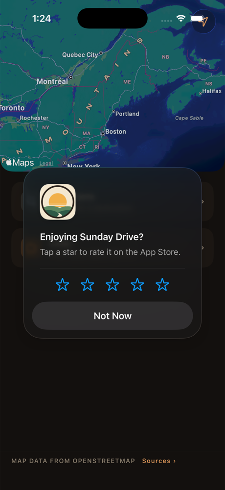

# The App Store rating prompt

**Status, 2026-10-08: built, tested in the simulator, not yet on a phone.**
Built on `claude/rating-prompt` off `main` at `8ad257f`. Until then the app
never asked for a rating (`git grep -i 'requestReview\|StoreKit' -- ios` was
empty).

## The rule

Decided with the owner on 2026-10-08.

- **What counts:** a drive that **arrived** (the arrival card's **Done**) and
  took **10 minutes or more** (`NavigationModel.elapsedMinutes`). Loops count;
  their card says "Back where you started". Ending a drive early (End, or
  `StalledView`'s "End drive") never reaches the counter, because the
  ended-early drive is often the bad one. Most of the owner's test drives end
  that way, so they won't count, which is intended.
- **When it asks:** from the **second** counted drive on, at most **once per
  app version** (`CFBundleShortVersionString`). Not on the first drive: a
  first-timer has not yet had the good drive the prompt should follow. Once per
  version keeps the app from spending Apple's three yearly showings on one
  release. Apple's own cap sits on top, invisibly.
- **Where:** **never on the arrival card or the driving screen.** The card
  appears near the destination, sometimes while the car is still rolling.
  Done only marks an ask as pending. The planning screen asks about a second
  after it is back (the 0.4 s cross-fade, then 1 s), so the ask is not the
  direct answer to the tap, which Apple's guidance asks for.
- **How:** SwiftUI's `@Environment(\.requestReview)`. The system decides
  whether the sheet actually appears. Guideline 5.6.1 forbids custom review
  prompts, so there is no "Rate us" button and no "Enjoying Sunday Drive?"
  pre-prompt, and there must never be one.

## Where it lives in code

| Piece | Where |
| --- | --- |
| The policy: count, `shouldAsk`, `didAsk`, the pending flag | `ios/Sources/RatingPrompt.swift` |
| Counting: Done calls `noteArrival(elapsedMinutes:)`, then `onDone` | `ios/Sources/ArrivalView.swift`, the Done button |
| Asking: `onChange(of: model.nav == nil)`, then `askForRating()` | `ios/Sources/ContentView.swift` |
| Tests | `ios/Tests/RatingPromptTests.swift` |

- **Stored on the phone:** two `UserDefaults` values,
  `ratingPromptArrivedDrives` (a count) and `ratingPromptLastAskedVersion` (a
  version string). Nothing about where or when. The pending flag is in memory
  only: it is set and spent within one trip from the card to the planning
  screen.
- **Privacy:** both are listed in `docs/privacy-policy.md` §1, and on
  `site/privacy/index.html`. §3 and the page's "Drive recordings" now say the
  count is the one thing a drive leaves behind. §1's list of imports, and the
  matching lines in `docs/legal-and-ip-audit.md` §1 and
  `docs/app-store-submission.md` (the Purchases row), now include `StoreKit`.
  The nutrition label does not change: nothing leaves the phone.
  `PrivacyInfo.xcprivacy` already declares `UserDefaults` (CA92.1).
- **Never under XCTest.** The suite runs in a hosted Debug app, where the sheet
  shows every time it is asked, and some tests drive to arrival.
  `RatingPrompt.shared` is built disabled when `XCTestConfigurationFilePath`
  is set, so it neither counts nor asks. The tests build their own instances
  on a throwaway `UserDefaults` suite.

## How it was checked

- **Tests** (`RatingPromptTests`, 10): the first counted drive does not ask and
  the second does; a 9.9-minute drive does not count and exactly 10 does; once
  asked, the same version does not ask again and a new version may; one Done
  asks at most once however often the planning screen appears; the planning
  screen alone (an early end) never asks, even with the count past two; the
  count and version survive a new instance and the pending flag does not; a
  disabled instance writes nothing; and the app's shared instance is disabled
  under XCTest.
- **The whole iOS suite**, with no server, on a fresh iPhone 17 Pro
  simulator (iOS 26.4): 460 run, 414 passed, 45 skipped, 1 failed. The
  failure is `DriveReplayTests.test_no_recorded_drive_hears_the_same_maneuver_twice`
  on the gitignored trace `drive-2026-10-06-122558.ndjson` (one maneuver said
  twice running; 149 utterances against a budget of 120). `main` at
  `8ad257f` fails the same two assertions with the same numbers when given
  the same `traces/`, so it predates this change. Only machines that have
  that trace in `traces/` see it.
- `tests/test_privacy_page.py`: 6 passed.
- **By eye, in a Debug simulator build**, where the sheet shows every time.
  The Debug-only launch argument `-ratingPromptDemo` (`ContentView.swift`,
  `#if DEBUG`) records two 10-minute arrivals through the policy type and
  runs the same ask the planning screen runs after Done. It is compiled out of
  Release builds.

*Debug build, iPhone 17 Pro simulator, iOS 26.4, 2026-10-08, launched with
`-ratingPromptDemo`.* The sheet arrived about two seconds after launch (the
first frame, at about one second, was still the bare home screen), over the
planning screen. Afterwards the app's defaults held
`ratingPromptArrivedDrives = 2` and `ratingPromptLastAskedVersion = "1.0"`,
so the request went through the policy type, not around it.

The words on the sheet ("Enjoying Sunday Drive? Tap a star to rate it on the
App Store.") are Apple's, and the app cannot change them. It is not a
pre-prompt.

TestFlight never shows the sheet, so the screenshot above is the only way to
see it before release. In production Apple rate-limits it, so a driver who
qualifies may still not see it.

## Not checked

- **The Done → planning path, end to end, on screen.** Done calls
  `noteArrival` and then `onDone`, and `ContentView` asks when `model.nav`
  goes back to nil. The tests cover the policy for that sequence, and the demo
  covers the ask, but no run has tapped a real Done after a ten-minute drive.
  The first phone build with this in it will show the sheet only after a
  second drive that arrives, and only in a development build. A TestFlight
  build never shows it.
